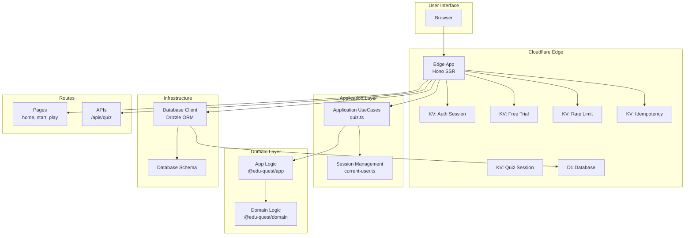

## 1. 概要

このドキュメントは、Gemini、Claude、Copilot などの AI アシスタントが **EduQuest** プロジェクトを理解し、貢献するための包括的なガイドです。

**EduQuest** は小学生向けに算数の練習を提供する教育プラットフォームであり、Cloudflare Workers 上で Hono を用いたサーバーサイドレンダリング (SSR) アーキテクチャを採用したモダンな Web スタックのモノレポジトリです。

### コアミッション

- 楽しく、惹きつけられ、効果的な学習体験を提供すること。
- Hono を用いた SSR アーキテクチャによって、スケーラブルで保守しやすく高性能なアプリケーションを構築すること。

## 2. 主要ドキュメント

このファイルは情報のハブです。詳しい内容は以下のドキュメントを参照してください。

- **[Project Overview](./docs/README.md)**: クイックスタート、リポジトリ構成、よく使うコマンド。
- **[Architecture Design](./docs/edu-quest-architecture.md)**: レイヤードアーキテクチャ、モジュール構成、データフロー、技術スタックの詳細。
- **[UI/UX Design Concept](./docs/ux-design-concept.md)**: デザイン哲学、ターゲットユーザー、ビジュアルテーマ、カラーパレット、ゲーミフィケーション戦略。
- **[Wireframes](./docs/edu-quest-wireframe.md)**: ホーム、ステージ選択、ゲーム、結果など主要画面のワイヤーフレーム。
- **[Local Development](./docs/local-dev.md)**: ローカル環境のセットアップとアプリケーションの起動方法。
- **[AI Assistant Rules](./docs/AI_RULES.md)**: 本リポジトリに貢献する AI アシスタント向けの共通ルールとガイドライン。
- **[Claude-specific Instructions](./docs/CLAUDE.md)**: Claude Code アシスタント向けの特有ガイダンス。

### 2.1. クエスト固有の設計ドキュメント

- **[KanjiQuest Design](./docs/kanji-quest-design.md)**: 漢字学習クエストの包括的な設計ドキュメント ([日本語版](./docs/kanji-quest-design.ja.md))

### 2.2. ドキュメントのローカライズ方針

**ファイル命名規則:**

- 英語版ファイルは `.md` 拡張子を使用する。
- 日本語訳ファイルは同名で `.ja.md` 拡張子を使用する。
- 英語版と日本語版は同じディレクトリに共存させる。

**同期要件:**

- **重要**: 任意の `.md` ファイルを変更したら、同じディレクトリにある対応する `.{locale}.md` ファイルも必ず更新すること。
- このルールは次を含むすべてのドキュメントに適用される。
  - プロジェクトドキュメント (AGENTS.md、README.md、CONTRIBUTING.md など)
  - 技術ドキュメント (docs/\*.md)
  - 設計ドキュメント (docs/edu-quest-_.md、docs/_-quest-design.md)
  - ワークフロードキュメント (docs/AI_RULES.md など)

**ワークフロー:**

1. ローカライズ版が存在するか確認する: 同じディレクトリに `{filename}.{locale}.md` があるか調べる。
2. 英語版 (`.md` ファイル) を更新する。
3. ローカライズ版 (`.{locale}.md` ファイル) も同等の内容に更新する。
4. ローカライズ版が存在しない場合は作成する。

**例:**

```bash
# AGENTS.md を更新したら AGENTS.ja.md も更新する
# docs/README.md を更新したら docs/README.ja.md も更新する
# docs/edu-quest-architecture.md を更新したら docs/edu-quest-architecture.ja.md も更新する
```

**AI アシスタントへの注意事項:**

- ドキュメント更新を完了する前に、ローカライズ版が存在するか必ず確認する。
- `ls` や `find` を使ってローカライズ版の有無を確認する。
- 翻訳に自信がない場合はユーザーに指示を仰ぐ。
- 二言語のドキュメント整合性は、バイリンガルユーザー層のために不可欠である。

### 2.3. ChatGPT Codex Connector 用コメントのローカライズ

ChatGPT Codex Connector のガイダンスを英語話者と日本語話者の両方にとって理解しやすく保つため、このファイルを編集する際は必ず英語と日本語の説明を対で記述してください。

- まず英語の説明を書き、その直後に意図が一致する日本語訳を追記する。
  - 英語での説明を書いた直後に、意図が変わらないよう同内容の日本語訳を必ず追記してください。
- 日本語訳は短いフレーズや機械翻訳の断片ではなく、意味が通る完結した文章で記述する。
  - 日本語訳は断片的な語句ではなく、意味が伝わる完結した文章で記述してください。
- 既存のテキストを更新するときは、英語と日本語の両方を同時にメンテナンスし、内容の不一致を避ける。
  - 既存の文章を更新するときは、英語と日本語の両方を同時にメンテナンスし、内容の食い違いが生じないようにしてください。

## 3. システムアーキテクチャ

### 3.1. ハイレベル図



### 3.2. モノレポ構成 (pnpm ワークスペース)

このプロジェクトは pnpm ワークスペースで管理されたモノレポです。

- **`apps/`**: 実行可能なアプリケーション。
  - `@edu-quest/edge`: Cloudflare Workers 上で動作するメインアプリケーション (SSR + BFF API)。
  - `@edu-quest/api`: ローカル API 開発向けの Node.js サーバー。
  - `@edu-quest/web`: ローカル Web 開発向けの Hono サーバー。
- **`packages/`**: 共有ライブラリ。
  - `@edu-quest/domain`: 問題生成や計算ルールなどの中核となるドメインロジック。アプリケーションの心臓部。
  - `@edu-quest/app`: ドメイン層を利用するアプリケーションロジック (クイズセッション管理、解答判定など)。
- **`infra/`**: Infrastructure as Code。
  - `terraform/`: Cloudflare リソース向けの Terraform 設定。
  - `migrations/`: D1 データベース向けのスキーマおよびマイグレーションスクリプト。
- **`docs/`**: プロジェクトの全ドキュメント。

## 4. 開発ワークフロー

### 4.1. コア原則

- **設定より規約:** 既存のプロジェクト規約に従うこと。
- **Lint は絶対:** すべてのコードは提出前に `just lint` を通過させること。
- **最小限の変更:** 小さく焦点の定まったコミットを心掛け、無関係なリファクタリングは避けること。
- **自動 Git 操作は禁止:** 明示的なユーザー指示がない限り、`git add`、`git commit`、`git push` を自動で実行してはならない。

### 4.2. 主なコマンド

- `just setup`: 依存関係のインストールと環境構築を行う。
- `just lint`: すべてのコード品質チェックを実行する。
- `just fix`: 自動整形と自動修正を実行する。
- `pnpm dev:edge`: ローカル開発用にメインアプリケーションを起動する。
- `just e2e`: E2E テストを実行する (開発サーバーが動作している必要あり)。
- `just e2e-ci`: 開発サーバーの起動を含む E2E テストの自動実行。

### 4.3. テスト

#### ユニットテスト

本プロジェクトでは **Vitest** をユニットテストに利用しています。

```bash
# すべてのユニットテストを実行
pnpm test

# ウォッチモードでユニットテストを実行
pnpm test:watch

# カバレッジレポートを生成
pnpm test:coverage
```

#### E2E テスト

画面遷移やユーザーフローの検証には **Playwright** を使用します。

**ローカル開発:**

```bash
# 1. 別ターミナルで Cloudflare Workers 開発サーバーを起動
pnpm dev:edge

# 2. ヘッドレスモードで E2E テストを実行
just e2e

# もしくは Playwright のテスト UI を起動
just e2e-open
```

**自動モード (CI または簡易検証):**

```bash
# 開発サーバーの起動・テスト実行・停止を自動化
just e2e-ci
```

**重要な注意点:**

- E2E テストは必ず `@edu-quest/edge` (Cloudflare Workers) 上で実行すること。`@edu-quest/web` は利用しない。
- `@edu-quest/web` はアプリケーションルートを持たないプレースホルダーの Node.js サーバーである。
- アプリケーションルートはすべて `@edu-quest/edge` のみに存在する。
- E2E テスト用のサーバーは常に `pnpm dev:edge` で起動する。

**CI/CD:**

以下のタイミングで E2E テストが自動実行される。

- `main` ブランチへのプッシュ
- プルリクエストの作成および更新

CI ワークフロー (`.github/workflows/e2e.yml`) は次の手順を実行する。

1. 依存関係をインストールし、必要なパッケージをビルドする。
2. バックグラウンドで開発サーバーを起動する。
3. すべての E2E テストを実行する。
4. 失敗時に Playwright レポート・トレース・メディアをアップロードする。

**テスト結果の確認:**

CI でテストが失敗した場合、Playwright のアーティファクトが GitHub Artifacts としてアップロードされる。

1. 失敗したワークフロー実行を開く。
2. ページ下部までスクロールする。
3. `playwright-report` アーティファクトをダウンロードする。
4. トレースやメディアを含む `playwright-test-results` アーティファクトをダウンロードする。
5. HTML レポートやスクリーンショット、動画を確認し、原因を特定する。

**テストカバレッジ:**

現在の E2E テストカバレッジ (16 テスト):

- ナビゲーションフロー (ホーム → MathQuest → ClockQuest)
- MathQuest 設定ウィザード
- ページ遷移と読み込み
- ブラウザの戻るボタンによる移動
- 旧 URL からのリダイレクト

#### コードカバレッジ

テストカバレッジの可視化には **Codecov** を利用しています。

**ローカルでのカバレッジレポート:**

```bash
# すべてのパッケージでカバレッジレポートを生成
pnpm test:coverage

# 生成されたレポートを確認
open packages/domain/coverage/index.html
open apps/edge/coverage/index.html
```

**CI/CD 連携:**

以下のタイミングでカバレッジレポートが自動的に Codecov にアップロードされる。

- `main` ブランチへのプッシュ
- プルリクエストの作成および更新

ワークフロー (`.github/workflows/codecov.yml`) の流れ:

1. カバレッジを有効にした状態でユニットテストを実行する。
2. 各パッケージの lcov レポートを生成する。
3. カバレッジデータを Codecov にアップロードする。
4. Codecov が PR にカバレッジ差分のコメントを残す。

**設定:**

- **`codecov.yml`**: プロジェクトレベルの Codecov 設定。
  - プロジェクトカバレッジ目標: 自動 (許容差 1%)
  - パッチカバレッジ目標: 自動 (許容差 1%)
  - 除外パス: tests、node_modules、infra、docs、games
- **Vitest 設定**: カバレッジプロバイダー (v8)、レポーター (text、json、html、lcov)

**重要な注意点:**

- カバレッジレポートには **v8** プロバイダーを利用しており、c8/istanbul より高速。
- Codecov との連携には **lcov** 形式が必須。
- リポジトリ設定で `CODECOV_TOKEN` シークレットを構成しておくこと。
- カバレッジコメントは PR に自動で投稿される。

#### セキュリティスキャン

Terraform のインフラコードに対するセキュリティスキャンには **Trivy** を使用します。

**ローカルでのセキュリティスキャン:**

```bash
# すべての Terraform 設定をスキャン
mise exec trivy -- trivy config infra/terraform --severity CRITICAL,HIGH,MEDIUM

# カスタム設定でスキャン
trivy config infra/terraform
```

**CI/CD 連携:**

以下のタイミングでセキュリティスキャンが自動実行される。

- Terraform ファイルを変更するプルリクエスト
- `main` ブランチへのプッシュ

ワークフロー (`.github/workflows/trivy-terraform.yml`) の流れ:

1. mise で Trivy をインストールする。
2. すべての Terraform 設定をスキャンする。
3. 結果を GitHub Security タブへ (SARIF 形式で) アップロードする。
4. PR にスキャン結果のコメントを残す。

**設定:**

- **`trivy.yaml`**: プロジェクトレベルの Trivy 設定。
  - 対象重大度: CRITICAL、HIGH、MEDIUM
  - スキャン種別: config、secret
  - 除外ディレクトリ: .git、.terraform、node_modules
- **`.trivyignore`**: 正当な理由付きで除外する検査項目を定義。

**pre-commit フック:**

Terraform ファイルを変更するコミット前には Trivy スキャンが自動実行される。

```bash
# 手動実行
pre-commit run trivy-terraform --all-files
```

**重要な注意点:**

- Trivy は旧来の tfsec ツールの後継 (tfsec は Trivy に統合済み)。
- ミスコンフィグや秘密情報、セキュリティ問題を検出する。
- 結果は追跡のため GitHub Security にアップロードされる。
- 誤検知を抑制する場合は `.trivyignore` に理由付きで追加する。

### 4.4. UI/UX ガイドライン

#### 解答入力方法

**重要: EduQuest ではすべてのコンテンツ (算数・時計・漢字) でボタンによる解答入力方式を採用します。**

これは全クエスト実装で必ず守るべきプラットフォーム全体の設計方針です。

**要件:**

- クイズ回答に標準的なブラウザ入力 (`<input type="text">`、`<input type="number">`、`<select>` など) を使用しないこと。
- ユーザーがクリック/タップして回答できる専用ボタンを必ず用意すること。
- **実装:** 各回答選択肢は SSR 互換性のため、`<form>` 内に配置された個別の `<button>` と隠し入力を組み合わせる。

**根拠:**

- **対象ユーザー:** キーボード入力が難しいことがある小学生 (1〜4 年生)。
- **デバイス最適化:** 大きなボタンによりモバイル/タブレットで操作しやすい。
- **UX 上の利点:**
  - 入力検証エラーや IME の問題を防げる。
  - ユーザー操作に即座に視覚的フィードバックを提供できる。
  - タイピングミスを排除し、ストレスを軽減できる。
  - すべてのクエストで一貫した操作体験を提供できる。

**クエスト別の実装例:**

- ✅ **MathQuest**: 数値回答用のテンキー風ボタン (0〜9)。
- ✅ **ClockQuest**: 時刻選択用の時間ボタン (1〜12)。
- ✅ **KanjiQuest**: 文字選択のための複数選択ボタン。
- ❌ **禁止**: `<input type="number">`、`<input type="text">` などのテキスト入力欄。

**実装パターン:**

```tsx
// SSR 互換性のため各ボタンを独立したフォームにする
{
  Array.from({ length: 10 }, (_, i) => (
    <form method="POST" key={i}>
      <input type="hidden" name="answer" value={i} />
      <button type="submit">{i}</button>
    </form>
  ));
}
```

このアプローチにより SSR 互換性を保ちながら、児童に最適なユーザー体験を提供できます。

## 5. コントリビュートの流れ

1. **目的を理解する:** ユーザーの依頼内容を丁寧に読み取る。
2. **ドキュメントを参照する:** 上記のドキュメントを確認し、関連するプロジェクト部分を理解する。まずはアーキテクチャとドメインロジックから着手すること。
3. **コードを特定する:** `glob` や `search_file_content` を活用して該当ファイルを見つける。ディレクトリ構成は論理的なので最初の手がかりになる。
4. **推測せず分析する:** 変更前に既存コードとその背景を必ず読み解く。
5. **実装する:** プロジェクトのスタイルと規約を厳守しながらコードを修正する。
6. **検証する:** `just lint` や関連するテストを実行し、変更によって不具合が生じていないか確認する。
7. **ドキュメントを更新する:** 挙動、ツール、ワークフローを変更した場合は、該当ドキュメントを必ず更新する。

## 6. マルチクエストアーキテクチャ

**EduQuest** は複数の教科コンテンツを専用の「クエスト」モジュールで提供する学習プラットフォームです。インフラとユーザー体験を統一するため、**サブディレクトリベースのルーティング構成** を採用しています。

### 6.1. クエストモジュール

現在提供中および提供予定のクエストは以下のとおりです。

- **MathQuest** (`/math`) - 学年別のプリセットやテーマ演習を備えた算数練習 (提供中)
- **KanjiQuest** (`/kanji`) - 学年別に整理された漢字学習 (近日公開)
- **ClockQuest** (`/clock`) - アナログ時計とデジタル時計の読み取り練習 (近日公開)

### 6.2. URL 構造

**サブディレクトリベースのルーティング:**

```text
ドメイン構成:
  dev.edu-quest.app (開発環境)
  edu-quest.app (本番環境)

ルート構成:
  /                    → EduQuest ハブ (クエスト選択ポータル)
  /math                → MathQuest ランディングページ
  /math/start          → MathQuest 設定ウィザード
  /math/play           → MathQuest 演習セッション
  /kanji               → KanjiQuest ランディングページ (近日公開)
  /clock               → ClockQuest ランディングページ (近日公開)
```

**後方互換性:**

- `/start` → `/math/start` (301 リダイレクト)
- `/play` → `/math/play` (301 リダイレクト)

### 6.3. 設計原則

- **サブディレクトリルーティング:** サブドメイン方式よりもインフラが簡素になり、セッションを統合しやすく SEO も向上する。
- **テーマのカスタマイズ:** 各クエストモジュールは CSS 変数による独自のカラースキームを持つ。
  - MathQuest: ブルーテーマ (#6B9BD1)
  - KanjiQuest: パープルテーマ (#9B7EC8)
  - ClockQuest: オレンジテーマ (#F5A85F)
- **共有ドメインロジック:** すべてのクエストモジュールは `@edu-quest/domain` と `@edu-quest/app` パッケージを再利用する。
- **一貫した UX:** すべてのクエストでナビゲーションや認証を統一する。

### 6.4. 命名規約

```text
ブランド:       EduQuest
ドメイン:       dev.edu-quest.app (開発)、edu-quest.app (本番)
パッケージ:     @edu-quest/*
ルート:
  - ポータル:  /
  - Math:    /math, /math/start, /math/play
  - Kanji:   /kanji (近日公開)
  - Clock:   /clock (近日公開)
```

**AI アシスタントへの注意:** 新しいクエストモジュールや機能を実装する際は、教科ごとのロジックを適切に分離しつつ、問題生成や回答判定などの共通処理には共有ドメインロジックを活用してください。

## 7. セッション管理ポリシー

### 7.1. セッション管理アーキテクチャ

**EduQuest はすべてのクエストモジュールで、安全なサーバーサイドセッション管理のために Cloudflare KV (Key-Value) ストレージを使用します。**

これはセキュリティ、スケーラビリティ、データ整合性を重視した基本方針です。

### 7.2. 推奨アプローチ: KV + セッション ID (パターン A)

**重要: クイズ/クエストのセッションデータは必ず Cloudflare KV にセッション ID をキーとして保存してください。**

**実装パターン:**

```typescript
// 1. セッション ID を生成
const sessionId = crypto.randomUUID();

// 2. TTL 付きでセッションデータを KV に保存
await c.env.KV_QUIZ_SESSION.put(
  `quest_type:${sessionId}`,
  JSON.stringify(sessionData),
  { expirationTtl: 1800 } // 30 分
);

// 3. セッション ID のみを保持した HttpOnly Cookie を設定
response.headers.append(
  'Set-Cookie',
  `session_id=${sessionId}; Path=/; Max-Age=1800; HttpOnly; Secure; SameSite=Strict`
);

// 4. KV からセッションデータを取得
const sessionData = await c.env.KV_QUIZ_SESSION.get(`quest_type:${sessionId}`);
const session = JSON.parse(sessionData);
```

### 7.3. なぜ KV ストレージなのか

**セキュリティ上の利点:**

- ✅ クイズ問題や正解がクライアントに露出しない。
- ✅ HttpOnly Cookie によるセッションハイジャック対策。
- ✅ クライアント側での改ざんが不可能。
- ✅ 機微なデータを安全に扱える。

**スケーラビリティの利点:**

- ✅ Cloudflare のグローバルネットワークに分散保存される。
- ✅ TTL による自動セッション期限切れ。
- ✅ サーバー側のメモリ管理が不要。
- ✅ 数百万規模の同時セッションをサポート可能。

**保守性の利点:**

- ✅ 認証セッション (`KV_AUTH_SESSION`) と統一されたアーキテクチャ。
- ✅ すべてのクエストモジュールで一貫した設計。
- ✅ シンプルなキーアクセスパターン。
- ✅ 期限管理が内蔵されている。

### 7.4. 利用可能なセッションストア

用途ごとに専用の KV 名前空間を使用します。

```toml
# wrangler.toml
[[kv_namespaces]]
binding = "KV_AUTH_SESSION"      # ユーザー認証セッション
id = "kv_auth_session_id"
preview_id = "kv_auth_session_preview"

[[kv_namespaces]]
binding = "KV_QUIZ_SESSION"      # クイズ/クエストセッションデータ
id = "kv_quiz_session_id"
preview_id = "kv_quiz_session_preview"

[[kv_namespaces]]
binding = "KV_FREE_TRIAL"        # 無料トライアルの追跡
id = "kv_free_trial_id"
preview_id = "kv_free_trial_preview"

[[kv_namespaces]]
binding = "KV_RATE_LIMIT"        # レート制限
id = "kv_rate_limit_id"
preview_id = "kv_rate_limit_preview"

[[kv_namespaces]]
binding = "KV_IDEMPOTENCY"       # 冪等性キー
id = "kv_idempotency_id"
preview_id = "kv_idempotency_preview"
```

### 7.5. セッションキーの命名規則

**フォーマット:** `{quest_type}:{session_id}`

**例:**

- `kanji:550e8400-e29b-41d4-a716-446655440000` - KanjiQuest のセッション
- `kanji_result:550e8400-e29b-41d4-a716-446655440001` - KanjiQuest の結果
- `math:550e8400-e29b-41d4-a716-446655440002` - MathQuest のセッション (将来追加)
- `clock:550e8400-e29b-41d4-a716-446655440003` - ClockQuest のセッション (将来追加)

### 7.6. クッキー名の命名規則

**フォーマット:** `{quest_type}_session_id` または `{quest_type}_result_id`

**例:**

- `kanji_session_id` - KanjiQuest の進行中セッション
- `kanji_result_id` - KanjiQuest の完了結果
- `math_session_id` - MathQuest の進行中セッション (将来追加)

### 7.7. セッションライフサイクル

```typescript
// 1. セッション開始 (/quest/start)
const sessionId = crypto.randomUUID();
await c.env.KV_QUIZ_SESSION.put(`quest:${sessionId}`, JSON.stringify(session), {
  expirationTtl: 1800,
});
setCookie(response, 'quest_session_id', sessionId, { httpOnly: true });

// 2. セッション継続 (/quest/quiz)
const sessionId = getCookie(c, 'quest_session_id');
const sessionData = await c.env.KV_QUIZ_SESSION.get(`quest:${sessionId}`);
const session = JSON.parse(sessionData);

// 3. セッション更新 (POST /quest/quiz)
await c.env.KV_QUIZ_SESSION.put(
  `quest:${sessionId}`,
  JSON.stringify(updatedSession),
  { expirationTtl: 1800 }
);

// 4. セッション完了
const resultId = crypto.randomUUID();
await c.env.KV_QUIZ_SESSION.put(
  `quest_result:${resultId}`,
  JSON.stringify(result),
  {
    expirationTtl: 300,
  }
); // 5 分
await c.env.KV_QUIZ_SESSION.delete(`quest:${sessionId}`);
setCookie(response, 'quest_result_id', resultId, { httpOnly: true });
clearCookie(response, 'quest_session_id');
```

### 7.8. 代替パターン (非推奨)

#### パターン B: 署名付きクッキー (⚠️ 回避推奨)

- 暗号署名付きクッキーにセッションデータを保存する方式。
- **課題:** クッキーサイズ制限 (4KB)、問題構造が露出、サーバー側での失効制御不可。

#### パターン C: クライアントサイドストレージ (❌ 使用禁止)

- セッションデータを localStorage/sessionStorage に保存する方式。
- **課題:** XSS 脆弱性、セキュリティなし、クライアントによる改ざん、SSR 非対応。

### 7.9. ローカル開発

プレビュー用名前空間により、ローカル開発でも KV ストレージをシームレスに利用できます。

```bash
# 開発サーバーを起動すると KV も自動的に利用可能
pnpm dev:edge

# wrangler がローカル KV ストアを自動的に用意する
# env.KV_QUIZ_SESSION (kv_quiz_session_preview) - ローカル KV 名前空間
```

### 7.10. 実装チェックリスト

新しいクエストモジュールを実装する際は次を確認する。

- [ ] `wrangler.toml` に必要な KV 名前空間を追加する (既存の `KV_QUIZ_SESSION` を使う場合は不要)。
- [ ] `apps/edge/src/env.ts` の `Env` 型を更新する。
- [ ] セッション ID の生成には `crypto.randomUUID()` を使用する。
- [ ] セッションデータの TTL はアクティブ 1800 秒、結果 300 秒を目安に設定する。
- [ ] HttpOnly・Secure・SameSite 属性を付与したクッキーを使用する。
- [ ] キーとクッキーの命名規約に従う。
- [ ] セッション完了時にデータをクリーンアップする。
- [ ] 機微情報をクライアントへ露出しない。

**AI アシスタントへの注意:** クエストのセッション管理を実装する際は必ず KV + セッション ID パターン (パターン A) を採用してください。これはセキュリティとアーキテクチャ上の譲れない要件です。クライアントサイドでのセッション管理やクイズデータをクッキーに保存する実装は厳禁です。

## 8. 静的データ管理ポリシー

### 8.1. 漢字などの教育データ

**EduQuest では、漢字や語彙といった教育用マスターデータをデータベースではなく JSON ファイルで管理します。**

これはシンプルさ・パフォーマンス・保守性を重視したアーキテクチャ上の選択です。

### 8.2. 現在の手法: ドメインパッケージ内の JSON ファイル

**重要: 漢字のマスターデータは `packages/domain/src/data/` 配下の JSON ファイルに保存してください。**

**実装例:**

```typescript
// packages/domain/src/data/kanji-grade-1.json
[
  {
    "character": "一",
    "grade": 1,
    "strokeCount": 1,
    "readings": {
      "onyomi": ["イチ", "イツ"],
      "kunyomi": ["ひと-", "ひと-つ"]
    },
    "meanings": ["one"],
    "radicals": ["一"],
    "examples": [...]
  }
]

// packages/domain/src/kanji-quest.ts
import kanjiGrade1Data from './data/kanji-grade-1.json';

function loadKanjiDataByGrade(grade: KanjiGrade): Kanji[] {
  switch (grade) {
    case 1:
      return kanjiGrade1Data as Kanji[];
    case 2:
      return kanjiGrade2Data as Kanji[];
    // ...
  }
}
```

### 8.3. なぜ JSON ファイルなのか

**利点:**

- ✅ **シンプルさ:** 管理が容易でバージョン管理もしやすい。
- ✅ **パフォーマンス:** データベースクエリが不要で即時アクセス可能。
- ✅ **静的コンテンツ:** 文科省カリキュラムに基づくため変更頻度が低い。
- ✅ **バンドル最適化:** Worker のバンドルに自動的に含まれる。
- ✅ **バージョン管理:** Git 上で履歴を追跡できる。
- ✅ **型安全性:** TypeScript のインターフェースで構造を検証できる。
- ✅ **ローカル開発:** データベースのセットアップ不要。
- ✅ **デプロイ:** コードとデータを一体でデプロイできる。

**トレードオフ:**

- ⚠️ **更新の手間:** 変更にはコードの再デプロイが必要 (安定した教育コンテンツでは許容範囲)。
- ⚠️ **動的更新:** 実行時に内容を更新できない (カリキュラムベースのデータでは問題なし)。

### 8.4. データベースを検討すべきケース

以下の機能を実装する場合のみ、データベース移行を検討する。

**ユーザー生成コンテンツ:**

- 教員によるカスタム漢字学習セット
- ユーザー専用のフラッシュカードコレクション
- 個別学習パス

**学習分析:**

- 生徒ごとの進捗管理
- ユーザー単位の漢字習熟度
- 学習履歴と統計
- 誤答傾向の分析
- 時間経過に基づくパフォーマンス指標

**アダプティブラーニング:**

- 間隔反復 (Spaced Repetition)
- ユーザーごとの難易度調整
- 苦手領域に基づく問題生成

**コンテンツ管理:**

- 管理者向けコンテンツ編集ダッシュボード
- 問題バリエーションの A/B テスト
- デプロイ不要の動的コンテンツ更新

### 8.5. ハイブリッドアプローチ (今後の推奨方針)

**マスターデータ (静的):** ドメインパッケージ内の JSON ファイル

- 漢字とそのメタデータ
- 学年別カリキュラムデータ
- 正式な読みと意味
- 画数と部首

**ユーザーデータ (動的):** データベース (D1)

- ユーザーごとの学習進捗
- 正解/不正解の履歴
- 最終学習日時
- 習熟度
- カスタム学習セット

**将来のスキーマ例:**

```sql
-- ユーザー学習進捗
CREATE TABLE kanji_progress (
  user_id TEXT NOT NULL,
  character TEXT NOT NULL,
  grade INTEGER NOT NULL,
  correct_count INTEGER DEFAULT 0,
  incorrect_count INTEGER DEFAULT 0,
  last_studied_at DATETIME,
  mastery_level INTEGER DEFAULT 0,
  PRIMARY KEY (user_id, character)
);

-- カスタム学習セット
CREATE TABLE study_sets (
  id TEXT PRIMARY KEY,
  user_id TEXT NOT NULL,
  name TEXT NOT NULL,
  kanji_list TEXT NOT NULL, -- 漢字の JSON 配列
  created_at DATETIME DEFAULT CURRENT_TIMESTAMP
);
```

### 8.6. 実装ガイドライン

**行うこと:**

- ✅ カリキュラムベースの教育コンテンツは JSON ファイルに保存する。
- ✅ TypeScript のインターフェースでデータ構造を検証する。
- ✅ 学年やカテゴリごとにデータを整理する。
- ✅ JSON には読み、意味、例などのメタデータを十分に含める。
- ✅ すべての教育コンテンツをバージョン管理する。
- ✅ データソース (例: 文部科学省の学習指導要領) をドキュメント化する。

**避けること:**

- ❌ ユーザー固有の学習データを JSON ファイルに保存する。
- ❌ 頻繁に変わるコンテンツを JSON ファイルで扱う。
- ❌ JSON データ用のコンテンツ管理 UI を実装する。
- ❌ 静的ファイルに分析データや進捗データを保存する。
- ❌ マスターデータとユーザーデータを混在させる。

### 8.7. 移行パス

ユーザー進捗管理が必要になった場合の手順:

1. マスターデータは `packages/domain/src/data/` に保持する。
2. ユーザー学習データ用のデータベーススキーマを追加する。
3. `infra/migrations/` にマイグレーションスクリプトを作成する。
4. データアクセスにはリポジトリパターンを導入する。
5. クエリ時に静的データと動的データを結合する。

**例:**

```typescript
// JSON から静的データを読み込む
const kanji = loadKanjiDataByGrade(1);

// データベースから動的データを取得
const progress = await db
  .select()
  .from(kanjiProgress)
  .where(eq(kanjiProgress.userId, userId));

// 個別学習体験のために結合
const personalizedKanji = kanji.map((k) => ({
  ...k,
  userProgress: progress.find((p) => p.character === k.character),
}));
```

**AI アシスタントへの注意:** 語彙や文法など教育コンテンツを扱う新しいクエストモジュールを実装するときは、まず JSON ファイルでマスターデータを管理してください。進捗追跡やアダプティブラーニングなどユーザー固有の機能を実装する段階になって初めてデータベース移行を検討し、この分離を守ることでシンプルさと将来の拡張性を両立できます。

## 9. ファビコン管理ポリシー

### 9.1. クエスト固有のファビコン

**EduQuest はユーザーに視覚的なコンテキストを提供するため、クエスト種類ごとにファビコンを切り替えます。**

これは全クエストでブランドと体験を統一するための必須パターンです。

### 9.2. 実装パターン

**重要: 各クエストモジュールには専用のファビコンエンドポイントを用意し、`Document` コンポーネント経由で適用してください。**

**アーキテクチャ:**

```typescript
// 1. apps/edge/src/index.tsx にファビコンエンドポイントを定義
app.get('/favicon-{quest}.svg', (c) => {
  const svg = `<svg xmlns="http://www.w3.org/2000/svg" viewBox="0 0 100 100">
  <rect width="100" height="100" fill="{color}" rx="15"/>
  <text x="50" y="70" font-size="60" text-anchor="middle" fill="white" font-family="sans-serif" font-weight="bold">{character}</text>
</svg>`;
  return c.body(svg, 200, {
    'Content-Type': 'image/svg+xml',
    'Cache-Control': 'public, max-age=86400',
  });
});

// 2. ルートハンドラーでファビコンを適用
app.get('/{quest}', async (c) =>
  c.render(<QuestHome />, {
    title: 'Quest Title',
    description: 'Quest Description',
    favicon: '/favicon-{quest}.svg', // ファビコンを指定
  })
);

// 3. Document コンポーネントで favicon prop を使用
export const Document: FC<DocumentProps> = ({
  favicon,
  // ...
}) => {
  const defaultFavicon = "data:image/svg+xml,..."; // デフォルトの MQ ファビコン

  return html`
    <link
      rel="icon"
      type="image/svg+xml"
      href="${favicon || defaultFavicon}"
    />
  `;
};
```

### 9.3. クエスト用ファビコンの仕様

**デザイン要件:**

- **形式:** SVG (専用エンドポイントで配信)
- **サイズ:** 最適表示のため viewBox 100x100
- **角丸:** 15px の角丸
- **カラー:** クエストのテーマカラーパレットに合わせる
- **文字:** 対応する漢字または英語の略称
- **フォント:** 太字サンセリフ、サイズ 60px、文字色は白
- **キャッシュ:** 24 時間 (`max-age=86400`)

**現在のファビコン割り当て:**

| クエスト種別 | エンドポイント       | 背景色               | 文字 | テーマ      |
| ------------ | -------------------- | -------------------- | ---- | ----------- |
| MathQuest    | (default)            | `#78c2c3` (ティール) | `MQ` | 青/ティール |
| KanjiQuest   | `/favicon-kanji.svg` | `#9B87D4` (パープル) | `漢` | パープル    |
| ClockQuest   | `/favicon-clock.svg` | `#F5A85F` (オレンジ) | `時` | オレンジ    |

### 9.4. 実装チェックリスト

新しいクエストモジュールを実装するときは以下を確認する。

- [ ] `apps/edge/src/index.tsx` に `/favicon-{quest}.svg` エンドポイントを作成する。
- [ ] 背景色 (`fill` 属性) にはクエストのテーマカラーを指定する。
- [ ] 代表的な文字 (漢字または英語略称) を選択する。
- [ ] CDN キャッシュのため `Cache-Control: public, max-age=86400` を設定する。
- [ ] すべてのクエストルート (`c.render()` 呼び出し) に `favicon` プロパティを渡す。
- [ ] ブラウザタブでファビコンが正しく表示されるか確認する。
- [ ] クエスト間のナビゲーションでファビコンが切り替わることを確認する。
- [ ] クエスト以外のページ (`/`) ではデフォルトの MathQuest ファビコンが表示されるか確認する。

### 9.5. ファビコンを渡す必要があるルート

**各クエストモジュールでは、すべてのルートでファビコンを適用してください。**

```typescript
// 例: KanjiQuest のルート
app.get('/kanji', async (c) => c.render(<KanjiHome />, { favicon: '/favicon-kanji.svg' }));
app.get('/kanji/select', async (c) => c.render(<KanjiGradeSelect />, { favicon: '/favicon-kanji.svg' }));
app.get('/kanji/quiz', async (c) => c.render(<KanjiQuiz />, { favicon: '/favicon-kanji.svg' }));
app.get('/kanji/results', async (c) => c.render(<KanjiResults />, { favicon: '/favicon-kanji.svg' }));
```

### 9.6. デフォルトファビコン (MathQuest)

**デフォルトのファビコンは `Document` コンポーネント内でデータ URI として埋め込まれています。**

```typescript
const defaultFavicon =
  "data:image/svg+xml,%3Csvg xmlns='http://www.w3.org/2000/svg' width='64' height='64' viewBox='0 0 64 64'%3E%3Crect width='64' height='64' rx='18' fill='%2378c2c3'/%3E%3Ctext x='50%25' y='54%25' text-anchor='middle' fill='%231f2a4a' font-family='Zen Kaku Gothic New, sans-serif' font-size='28' font-weight='700'%3EMQ%3C/text%3E%3C/svg%3E";
```

**デフォルトが適用されるページ:**

- `/` (EduQuest ハブ)
- `/math` ルート (個別指定がない場合)
- その他のクエスト以外のページ

### 9.7. TypeScript の型定義

**`apps/edge/src/views/layouts/document.tsx` の `DocumentProps` 型を更新する:**

```typescript
export type DocumentProps = {
  lang: 'ja' | 'en';
  title?: string;
  description?: string;
  environment?: string;
  favicon?: string; // Optional favicon path
  children?: JSX.Element | JSX.Element[];
};
```

**`apps/edge/src/index.tsx` の `jsxRenderer` 型を更新する:**

```typescript
app.use(
  '*',
  jsxRenderer<{ title?: string; description?: string; favicon?: string }>(
    (props, c) => {
      return (
        <Document
          lang={lang}
          title={props.title}
          description={props.description}
          favicon={props.favicon}
          environment={environment}
        >
          {props.children}
        </Document>
      );
    }
  )
);
```

### 9.8. 根拠

**利点:**

- ✅ **視覚的コンテキスト:** ユーザーがどのクエストにいるか即座に分かる。
- ✅ **ブランド整合性:** 各クエストに固有のビジュアルアイデンティティを持たせられる。
- ✅ **ユーザー体験:** 複数タブを開いている場合でも、ブラウザタブに適切なアイコンが表示される。
- ✅ **スケーラビリティ:** 同じパターンで新しいクエスト用ファビコンを簡単に追加できる。
- ✅ **パフォーマンス:** SVG ファビコンは小型でキャッシュしやすく、拡大縮小も容易。
- ✅ **保守性:** ルーティング層に単一のソースを確保できる。

**AI アシスタントへの注意:** 新しいクエストモジュールを実装する際は、必ず専用のファビコンエンドポイントを作成し、すべてのクエストルートで適用してください。これはプラットフォーム全体のビジュアル一貫性を守るための必須要件です。
