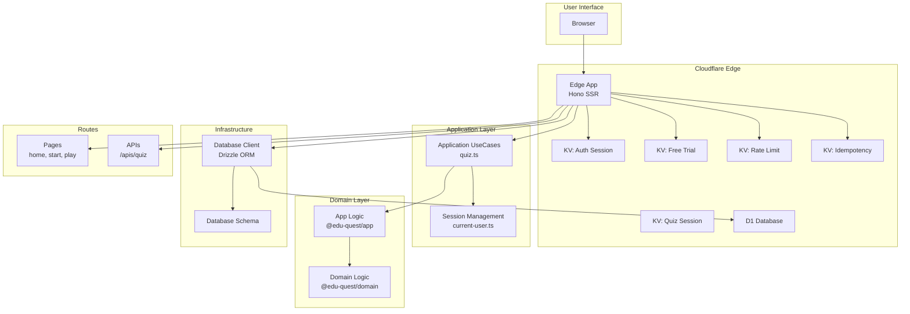

## 1. Overview

This document provides a comprehensive guide for AI assistants (like Gemini, Claude, Copilot) to understand and contribute to the **EduQuest** project.

**EduQuest** is an educational platform for elementary school students to practice arithmetic. It's a monorepo project built with a modern web stack, running on the Cloudflare edge network.

### Core Mission

- To provide a fun, engaging, and effective learning experience.
- To build a scalable, maintainable, and high-performance application using a server-side rendering (SSR) architecture with Hono on Cloudflare Workers.

## 2. Key Documentation

This file is the central hub. For detailed information, please refer to the specific documents below.

- **[Project Overview](./docs/README.md):** Quick start, repository structure, and frequently used commands.
- **[Architecture Design](./docs/edu-quest-architecture.md):** In-depth explanation of the layered architecture, module configuration, data flow, and technology stack.
- **[UI/UX Design Concept](./docs/ux-design-concept.md):** The design philosophy, target users, visual theme, color palette, and gamification strategy.
- **[Wireframes](./docs/edu-quest-wireframe.md):** Structural blueprints for the main application screens (Home, Stage Select, Game, Results, etc.).
- **[Local Development](./docs/local-dev.md):** Guide for setting up and running the project locally.
- **[AI Assistant Rules](./docs/AI_RULES.md):** Common rules and guidelines for AI assistants contributing to this repository.
- **[Claude-specific Instructions](./docs/CLAUDE.md):** Specific guidance for the Claude Code assistant.
- **[rulesync Guide](./docs/RULESYNC.md):** How to use the `rulesync` tool to keep configuration files up-to-date.

### 2.1. Quest-Specific Design Documents

- **[KanjiQuest Design](./docs/kanji-quest-design.md):** Comprehensive design document for the Kanji learning quest ([日本語版](./docs/kanji-quest-design.ja.md))

### 2.2. Documentation Localization Policy

**File Naming Convention:**

- English files use the `.md` extension.
- Japanese translations use the matching filename with the `.ja.md` extension.
- Both files must exist in the same directory.

**Synchronization Requirement:**

- **CRITICAL**: When you modify any `.md` file, you **MUST** also update the corresponding `.{locale}.md` file in the same directory.
- This applies to **ALL** documentation files, including:
  - Project documentation (AGENTS.md, README.md, CONTRIBUTING.md, etc.)
  - Technical documentation (docs/\*.md)
  - Design documents (docs/edu-quest-\*.md, docs/\*-quest-design.md)
  - Workflow documentation (docs/RULESYNC.md, docs/AI_RULES.md, etc.)

**Workflow:**

1. Identify if a localized version exists: Check for `{filename}.{locale}.md` in the same directory.
2. Update the English version (`.md` file).
3. Update the localized version (`.{locale}.md` file) with equivalent content.
4. If the localized version doesn't exist yet, create it.

**Example:**

```bash
# When updating AGENTS.md, also update AGENTS.ja.md
# When updating docs/README.md, also update docs/README.ja.md
# When updating docs/edu-quest-architecture.md, also update docs/edu-quest-architecture.ja.md
```

**Note to AI Assistants:**

- Always check for sibling localized files before completing documentation updates.
- Use `ls` or `find` to verify localized versions exist.
- If you're unsure about the translation, ask the user for guidance.
- Maintaining documentation parity is critical for our bilingual user base.

## 3. System Architecture

### 3.1. High-Level Diagram



### 3.2. Monorepo Structure (pnpm workspaces)

The project is a monorepo managed with pnpm workspaces.

- **`apps/`**: Executable applications.
  - `@edu-quest/edge`: The main application (SSR + BFF API) running on Cloudflare Workers.
  - `@edu-quest/api`: A Node.js server for local API development.
  - `@edu-quest/web`: A Hono server for local web development.
- **`packages/`**: Shared libraries.
  - `@edu-quest/domain`: The core domain logic (problem generation, calculation rules). This is the heart of the application.
  - `@edu-quest/app`: Application logic that uses the domain layer (quiz session management, answer verification).
- **`infra/`**: Infrastructure as Code.
  - `terraform/`: Terraform configurations for Cloudflare resources.
  - `migrations/`: Database schemas and migration scripts for D1.
- **`docs/`**: All project documentation.

## 4. Development Workflow

### 4.1. Core Principles

- **Convention over Configuration:** Adhere to the established project conventions.
- **Linting is Law:** All code must pass linting checks (`just lint`) before submission.
- **Minimal Changes:** Make small, focused commits. Avoid unrelated refactoring.
- **No Automatic Git Operations:** **NEVER** execute `git add`, `git commit`, or `git push` automatically. Always wait for explicit user approval before making any Git operations.

### 4.2. Key Commands

- `just setup`: Installs all dependencies and sets up the environment.
- `just lint`: Runs all code quality checks.
- `just fix`: Applies automatic formatting and fixes.
- `pnpm dev:edge`: Starts the main application for local development.
- `just e2e`: Runs E2E tests (requires dev server running).
- `just e2e-ci`: Runs E2E tests with automatic server management.

### 4.3. Testing

#### Unit Tests

The project uses **Vitest** for unit testing:

```bash
# Run all unit tests
pnpm test

# Run unit tests in watch mode
pnpm test:watch

# Generate coverage report
pnpm test:coverage
```

#### E2E Tests

The project uses **Cypress** for end-to-end testing to verify screen transitions and user flows.

**Local Development:**

```bash
# 1. Start the Cloudflare Workers dev server in a separate terminal
pnpm dev:edge

# 2. Run E2E tests in headless mode
just e2e

# OR open Cypress test runner (interactive mode)
just e2e-open
```

**Automatic Mode (CI or quick testing):**

```bash
# Automatically start dev server, run tests, and shut down
just e2e-ci
```

**Important Notes:**

- E2E tests **MUST** run against `@edu-quest/edge` (Cloudflare Workers), **NOT** `@edu-quest/web`
- `@edu-quest/web` is a placeholder Node.js server without actual application routes
- All application routes exist only in `@edu-quest/edge`
- Always use `pnpm dev:edge` to start the server for E2E testing

**CI/CD:**

E2E tests run automatically on:

- Push to `main` branch
- Pull request creation/updates

The CI workflow (`.github/workflows/e2e.yml`):

1. Installs dependencies and builds required packages
2. Starts the dev server in the background
3. Runs all E2E tests
4. Uploads screenshots and videos on failure

**Viewing Test Results:**

When tests fail in CI, screenshots are uploaded as GitHub Artifacts:

1. Go to the failed workflow run
2. Scroll to the bottom of the page
3. Download the `cypress-screenshots` artifact
4. Review the screenshots to diagnose the issue

**Test Coverage:**

Current E2E test coverage (16 tests):

- Navigation flows (home → MathQuest → ClockQuest)
- MathQuest configuration wizard
- Page transitions and loading
- Browser back button navigation
- Legacy URL redirects

#### Code Coverage

The project uses **Codecov** to track and visualize test coverage metrics:

**Local Coverage Reports:**

```bash
# Generate coverage reports for all packages
pnpm test:coverage

# View coverage reports
open packages/domain/coverage/index.html
open apps/edge/coverage/index.html
```

**CI/CD Integration:**

Coverage reports are automatically uploaded to Codecov on:

- Push to `main` branch
- Pull request creation/updates

The workflow (`.github/workflows/codecov.yml`):

1. Runs unit tests with coverage enabled
2. Generates lcov reports for each package
3. Uploads coverage data to Codecov
4. Codecov comments on PRs with coverage diff

**Configuration:**

- **`codecov.yml`**: Project-level Codecov settings
  - Project coverage target: auto (1% threshold)
  - Patch coverage target: auto (1% threshold)
  - Ignore paths: tests, node_modules, infra, docs, games, cypress
- **Vitest configs**: Coverage provider (v8), reporters (text, json, html, lcov)

**Important Notes:**

- Coverage reports use the **v8** provider (faster than c8/istanbul)
- **lcov** format is required for Codecov integration
- `CODECOV_TOKEN` secret must be configured in repository settings
- Coverage comments appear automatically on pull requests

#### Security Scanning

The project uses **Trivy** for security scanning of Terraform infrastructure code:

**Local Security Scans:**

```bash
# Scan all Terraform configurations
mise exec trivy -- trivy config infra/terraform --severity CRITICAL,HIGH,MEDIUM

# Scan with custom configuration
trivy config infra/terraform
```

**CI/CD Integration:**

Security scans run automatically on:

- Pull requests that modify Terraform files
- Push to `main` branch

The workflow (`.github/workflows/trivy-terraform.yml`):

1. Installs Trivy via mise
2. Scans all Terraform configurations
3. Uploads results to GitHub Security tab (SARIF format)
4. Comments on PRs with scan results

**Configuration:**

- **`trivy.yaml`**: Project-level Trivy settings
  - Severity levels: CRITICAL, HIGH, MEDIUM
  - Scan types: config, secret
  - Skip directories: .git, .terraform, node_modules
- **`.trivyignore`**: Ignored security checks with justification

**Pre-commit Hook:**

Trivy security scan runs automatically before commits that modify Terraform files:

```bash
# Manual run
pre-commit run trivy-terraform --all-files
```

**Important Notes:**

- Trivy replaces the legacy tfsec tool (tfsec is now part of Trivy)
- Scans detect misconfigurations, secrets, and security issues
- Results are uploaded to GitHub Security for tracking
- Use `.trivyignore` to suppress false positives with justification

### 4.4. UI/UX Guidelines

#### Answer Input Method

**CRITICAL: EduQuest uses button-based answer input across all content types (math, time, kanji).**

This is a fundamental platform-wide design decision that MUST be followed for all Quest implementations:

**Requirements:**

- **DO NOT use** standard browser input controls (`<input type="text">`, `<input type="number">`, `<select>`, etc.) for quiz answer submission
- **USE** dedicated answer buttons that users can click/tap to submit their answers
- **Implementation:** Each answer option should be a separate `<button>` within a `<form>` with hidden inputs for SSR compatibility

**Rationale:**

- **Target Audience:** Elementary school students (grades 1-4) who may struggle with keyboard input
- **Device Optimization:** Better mobile/tablet experience with large, tappable buttons
- **UX Benefits:**
  - Prevents input validation errors and IME-related issues
  - Provides immediate visual feedback on user interaction
  - Eliminates typing mistakes and frustration
  - Consistent interaction pattern across all Quest types

**Examples by Quest Type:**

- ✅ **MathQuest**: Number pad buttons (0-9) for numeric answers
- ✅ **ClockQuest**: Hour buttons (1-12) for time selection
- ✅ **KanjiQuest**: Multiple choice buttons for character selection
- ❌ **NEVER**: `<input type="number">`, `<input type="text">`, or other text input fields

**Implementation Pattern:**

```tsx
// Each button is a separate form for SSR compatibility
{
  Array.from({ length: 10 }, (_, i) => (
    <form method="POST" key={i}>
      <input type="hidden" name="answer" value={i} />
      <button type="submit">{i}</button>
    </form>
  ));
}
```

This approach maintains SSR compatibility while providing an optimal user experience for young learners.

## 5. How to Contribute

1.  **Understand the Goal:** Read the user's request carefully.
2.  **Consult the Docs:** Refer to the documents linked above to understand the relevant parts of the project. Start with the architecture and domain logic.
3.  **Locate the Code:** Use `glob` or `search_file_content` to find the relevant files. The directory structure is logical and should be your first guide.
4.  **Analyze, Don't Assume:** Read the existing code and its context before making changes.
5.  **Implement Changes:** Modify the code, adhering strictly to the project's style and conventions.
6.  **Verify:** Run `just lint` and any relevant tests to ensure your changes are correct and don't break anything.
7.  **Update Documentation:** If you change any behavior, tool, or workflow, update the corresponding documentation.

## 6. Multi-Quest Architecture

**EduQuest** is a multi-subject learning platform that provides various educational content through specialized "Quest" modules. The platform uses a **subdirectory-based routing structure** for simplicity and unified user experience.

### 6.1. Quest Modules

The platform currently supports and plans to support the following Quest modules:

- **MathQuest** (`/math`) - Arithmetic practice with grade-level presets and themed exercises (Available)
- **KanjiQuest** (`/kanji`) - Kanji learning organized by grade level (Coming Soon)
- **ClockQuest** (`/clock`) - Time-reading practice with analog and digital clocks (Coming Soon)

### 6.2. URL Structure

**Subdirectory-based routing:**

```text
Domain Structure:
  dev.edu-quest.app (development)
  edu-quest.app (production)

Route Structure:
  /                    → EduQuest hub (Quest selection portal)
  /math                → MathQuest landing page
  /math/start          → MathQuest configuration wizard
  /math/play           → MathQuest practice session
  /kanji               → KanjiQuest landing page (Coming Soon)
  /clock               → ClockQuest landing page (Coming Soon)
```

**Backward Compatibility:**

- `/start` → `/math/start` (301 redirect)
- `/play` → `/math/play` (301 redirect)

### 6.3. Design Principles

- **Subdirectory Routing:** Simpler infrastructure, unified sessions, and better SEO compared to subdomain approach
- **Theme Customization:** Each Quest module has its own color scheme applied via CSS variables
  - MathQuest: Blue theme (#6B9BD1)
  - KanjiQuest: Purple theme (#9B7EC8)
  - ClockQuest: Orange theme (#F5A85F)
- **Shared Domain Logic:** All Quest modules reuse `@edu-quest/domain` and `@edu-quest/app` packages
- **Consistent UX:** Unified navigation and authentication across all Quest modules

### 6.4. Naming Conventions

```text
Brand:       EduQuest
Domains:     dev.edu-quest.app (dev), edu-quest.app (prod)
Packages:    @edu-quest/*
Routes:
  - Portal:  /
  - Math:    /math, /math/start, /math/play
  - Kanji:   /kanji (Coming Soon)
  - Clock:   /clock (Coming Soon)
```

**Note to AI Assistants:** When implementing new Quest modules or features, ensure that subject-specific logic is properly isolated while leveraging shared domain logic for common functionality (question generation patterns, answer verification, etc.).

## 7. Session Management Policy

### 7.1. Session Management Architecture

**EduQuest uses Cloudflare KV (Key-Value) storage for secure server-side session management across all Quest modules.**

This is a fundamental architectural decision that prioritizes security, scalability, and data integrity.

### 7.2. Recommended Approach: KV + Session ID (Pattern A)

**CRITICAL: All Quiz/Quest session data MUST be stored in Cloudflare KV with session ID-based access.**

**Implementation Pattern:**

```typescript
// 1. Generate unique session ID
const sessionId = crypto.randomUUID();

// 2. Store session data in KV with TTL
await c.env.KV_QUIZ_SESSION.put(
  `quest_type:${sessionId}`,
  JSON.stringify(sessionData),
  { expirationTtl: 1800 } // 30 minutes
);

// 3. Set HttpOnly cookie with session ID only
response.headers.append(
  'Set-Cookie',
  `session_id=${sessionId}; Path=/; Max-Age=1800; HttpOnly; Secure; SameSite=Strict`
);

// 4. Retrieve session data from KV
const sessionData = await c.env.KV_QUIZ_SESSION.get(`quest_type:${sessionId}`);
const session = JSON.parse(sessionData);
```

### 7.3. Why KV Storage?

**Security Benefits:**

- ✅ Quiz questions and correct answers never exposed to client
- ✅ Session hijacking prevention with HttpOnly cookies
- ✅ No client-side tampering possible
- ✅ Secure handling of sensitive data

**Scalability Benefits:**

- ✅ Distributed storage across Cloudflare's global network
- ✅ Automatic session expiration via TTL
- ✅ No server-side memory management required
- ✅ Supports millions of concurrent sessions

**Maintainability Benefits:**

- ✅ Consistent with authentication session management (`KV_AUTH_SESSION`)
- ✅ Unified architecture across all Quest modules
- ✅ Simple key-based access pattern
- ✅ Built-in expiration handling

### 7.4. Available Session Stores

The project uses dedicated KV namespaces for different purposes:

```toml
# wrangler.toml
[[kv_namespaces]]
binding = "KV_AUTH_SESSION"      # User authentication sessions
id = "kv_auth_session_id"
preview_id = "kv_auth_session_preview"

[[kv_namespaces]]
binding = "KV_QUIZ_SESSION"      # Quiz/Quest session data
id = "kv_quiz_session_id"
preview_id = "kv_quiz_session_preview"

[[kv_namespaces]]
binding = "KV_FREE_TRIAL"        # Free trial tracking
id = "kv_free_trial_id"
preview_id = "kv_free_trial_preview"

[[kv_namespaces]]
binding = "KV_RATE_LIMIT"        # Rate limiting
id = "kv_rate_limit_id"
preview_id = "kv_rate_limit_preview"

[[kv_namespaces]]
binding = "KV_IDEMPOTENCY"       # Idempotency keys
id = "kv_idempotency_id"
preview_id = "kv_idempotency_preview"
```

### 7.5. Session Key Naming Convention

**Format:** `{quest_type}:{session_id}`

**Examples:**

- `kanji:550e8400-e29b-41d4-a716-446655440000` - KanjiQuest session
- `kanji_result:550e8400-e29b-41d4-a716-446655440001` - KanjiQuest result
- `math:550e8400-e29b-41d4-a716-446655440002` - MathQuest session (future)
- `clock:550e8400-e29b-41d4-a716-446655440003` - ClockQuest session (future)

### 7.6. Cookie Naming Convention

**Format:** `{quest_type}_session_id` or `{quest_type}_result_id`

**Examples:**

- `kanji_session_id` - KanjiQuest active session
- `kanji_result_id` - KanjiQuest completed result
- `math_session_id` - MathQuest active session (future)

### 7.7. Session Lifecycle

```typescript
// 1. Start Session (/quest/start)
const sessionId = crypto.randomUUID();
await c.env.KV_QUIZ_SESSION.put(`quest:${sessionId}`, JSON.stringify(session), {
  expirationTtl: 1800,
});
setCookie(response, 'quest_session_id', sessionId, { httpOnly: true });

// 2. Active Session (/quest/quiz)
const sessionId = getCookie(c, 'quest_session_id');
const sessionData = await c.env.KV_QUIZ_SESSION.get(`quest:${sessionId}`);
const session = JSON.parse(sessionData);

// 3. Update Session (POST /quest/quiz)
await c.env.KV_QUIZ_SESSION.put(
  `quest:${sessionId}`,
  JSON.stringify(updatedSession),
  { expirationTtl: 1800 }
);

// 4. Complete Session
const resultId = crypto.randomUUID();
await c.env.KV_QUIZ_SESSION.put(
  `quest_result:${resultId}`,
  JSON.stringify(result),
  {
    expirationTtl: 300,
  }
); // 5 minutes
await c.env.KV_QUIZ_SESSION.delete(`quest:${sessionId}`);
setCookie(response, 'quest_result_id', resultId, { httpOnly: true });
clearCookie(response, 'quest_session_id');
```

### 7.8. Alternative Patterns (Not Recommended)

#### Pattern B: Signed Cookies (⚠️ Avoid)

- Session data stored in cookies with cryptographic signature
- **Issues:** 4KB cookie size limit, exposes question structure, no server-side invalidation

#### Pattern C: Client-Side Storage (❌ Never Use)

- Session data in localStorage/sessionStorage
- **Issues:** XSS vulnerability, no security, client-side tampering, SSR incompatible

### 7.9. Local Development

KV storage works seamlessly in local development with preview namespaces:

```bash
# Start development server (KV automatically available)
pnpm dev:edge

# wrangler automatically provisions local KV stores
# env.KV_QUIZ_SESSION (kv_quiz_session_preview) - KV Namespace local
```

### 7.10. Implementation Checklist

When implementing new Quest modules:

- [ ] Add KV namespace to `wrangler.toml` (if not using `KV_QUIZ_SESSION`)
- [ ] Update `Env` type in `apps/edge/src/env.ts`
- [ ] Use `crypto.randomUUID()` for session IDs
- [ ] Store session data with appropriate TTL (1800s for active, 300s for results)
- [ ] Use HttpOnly, Secure, SameSite cookies
- [ ] Follow naming conventions for keys and cookies
- [ ] Clean up sessions on completion
- [ ] Never expose sensitive data to client

**Note to AI Assistants:** When implementing Quest session management, ALWAYS use the KV + Session ID pattern (Pattern A). This is a non-negotiable security and architecture requirement. DO NOT implement client-side session management or store quiz data in cookies.
