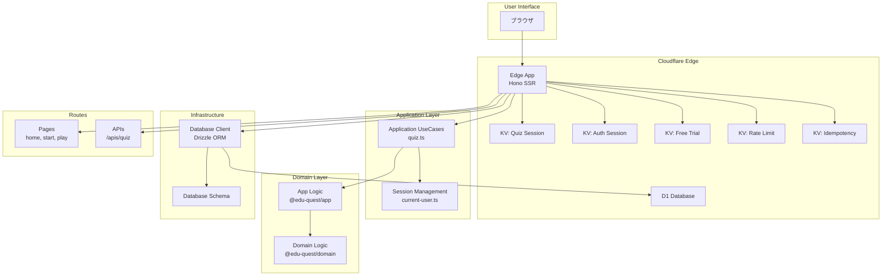
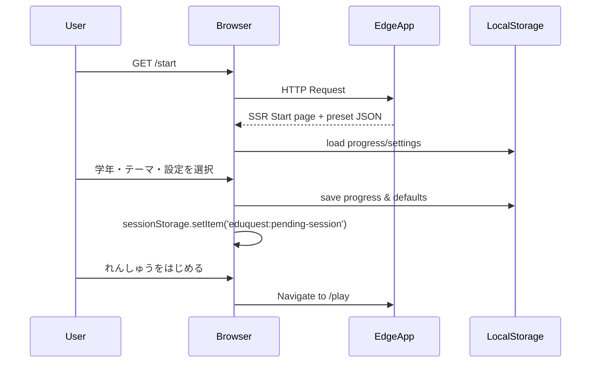
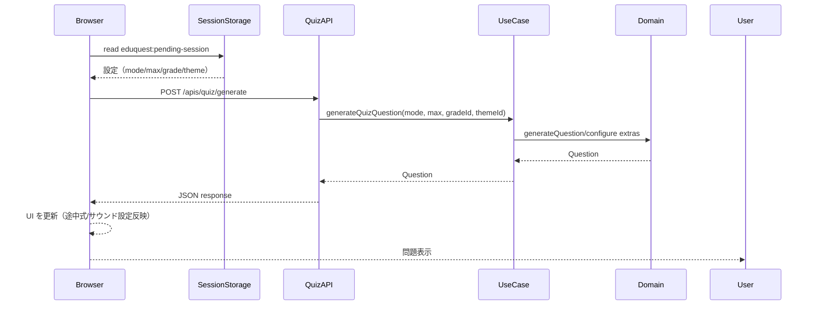
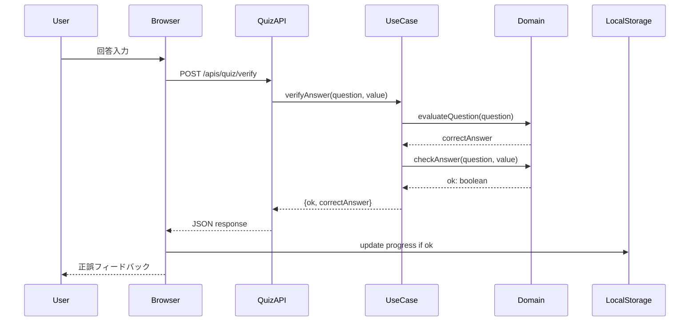

[🇺🇸 English](/docs/AGENTS.md)

# AGENTS.md

## 概要

EduQuestは小学生向けの算数学習プラットフォームで、Cloudflare Workers上で動作するHonoベースのSSRアプリケーションです。monorepoアーキテクチャを採用し、Edge Runtime、API/フロントエンドパッケージ、Terraform管理のインフラストラクチャを一つのリポジトリで管理しています。

## Quest モジュール構成

EduQuest は複数の「Quest」モジュールを通じて様々な教育コンテンツを提供します。

- **MathQuest** (`/math`) - 算数練習。学年別プリセットとテーマ練習を提供（利用可能）
- **KokugoQuest** (`/kokugo`) - 学年別に整理された漢字学習（準備中）
- **GameQuest** (`/game`) - パターン認識・空間認識・記憶力を鍛える脳トレミニゲーム（数独と Stellar Balance を提供）
- **ClockQuest** (`/clock`) - アナログ時計とデジタル時計を使った時刻の読み方練習（準備中）

## 現在の主要機能

- **ハブページ（`/`）**
  - 利用可能な Quest モジュールをテーマカラー付きカードで表示
  - 各 Quest への遷移ボタンを配置
- **MathQuest トップページ（`/math`）**
  - MathQuest 固有の情報と機能（学年プリセット、カスタマイズオプション、集中モード）を表示
  - 「算数をはじめる」ボタンから `/math/start` へ遷移
- **MathQuest スタート画面（`/math/start`）**
  - 学年（小1〜小6）、計算種類（たし算・ひき算・かけ算・四則演算）、テーマプリセット（例: 「たし算 20 まで」「ひき算 50 まで」）を選択
  - 効果音・途中式表示のトグル、問題数（本番: 10/20/30、開発モード: 1 問のデバッグオプション）を切り替え
  - `eduquest:progress:v1`（解答数/正解数/最後の学年）、`eduquest:sound-enabled`、`eduquest:show-working`、`eduquest:question-count-default` に設定を保存
  - 選択内容は `eduquest:pending-session` として `sessionStorage` に退避し、プレイ画面へシームレスに引き継ぎ
- **MathQuest プレイ画面（`/math/play`）**
  - 3 秒カウントダウン後に問題を表示。テンキー UI、ストリーク表示、途中式のトグル、サウンド再生を実装
  - `/apis/quiz/generate` で新しい問題を取得し、`/apis/quiz/verify` で採点。正解時は進捗をローカルストレージへ反映
  - ラウンド完了時は結果カードで正答数・経過時間を提示し、スタート画面への導線を表示
- **ユースケース / API**
  - `generateQuizQuestion` は学年・テーマに応じて `generateGradeOneQuestion` や複数項目の加減算ロジックを選択。
  - `verifyAnswer` はクライアントから渡された途中式 (`extras`) を含む問題を評価し、正解値と正誤を返却。
- **共有ロジック**
  - `@edu-quest/domain` が全ての問題生成・採点ロジックを提供。学年別テーマや複数ステップ計算を純関数として実装。
  - `@edu-quest/app` が出題回数や正解数のカウントを担当し、UI から副作用を切り離してテストしやすい構造にしている。

## システムアーキテクチャ

### 全体構成図



### モジュール依存関係

```mermaid
graph LR
    subgraph "Apps"
        Edge[@edu-quest/edge]
        API[@edu-quest/api]
        Web[@edu-quest/web]
    end

    subgraph "Packages"
        Domain[@edu-quest/domain]
        App[@edu-quest/app]
    end

    Edge --> App
    Edge --> Domain
    API --> App
    API --> Domain
    App --> Domain
```

## プロジェクト構成

### ディレクトリ構造

```text
eduquest/
├── apps/                    # アプリケーション群
│   ├── edge/               # Cloudflare Workers エッジアプリ（メイン）
│   │   ├── src/
│   │   │   ├── application/        # アプリケーション層
│   │   │   │   ├── usecases/      # ユースケース（quiz.ts）
│   │   │   │   └── session/       # セッション管理
│   │   │   ├── infrastructure/    # インフラ層
│   │   │   │   └── database/      # DB クライアント & スキーマ
│   │   │   ├── routes/            # ルーティング
│   │   │   │   ├── pages/         # SSR ページ（home, start, play）
│   │   │   │   └── apis/          # BFF API（/apis/quiz）
│   │   │   ├── views/             # ビュー層
│   │   │   │   └── layouts/       # レイアウトコンポーネント
│   │   │   ├── middlewares/       # ミドルウェア（i18n等）
│   │   │   ├── env.ts             # 環境変数型定義
│   │   │   └── index.tsx          # エントリーポイント
│   │   └── wrangler.toml          # Cloudflare Workers設定
│   ├── api/                # Node.js API サーバー（開発用）
│   └── web/                # Hono Webサーバー（開発用）
├── packages/                # 共有パッケージ
│   ├── domain/             # ドメインロジック
│   │   └── src/
│   │       └── index.ts    # 問題生成、計算ロジック
│   └── app/                # アプリケーションロジック
│       └── src/
│           └── index.ts    # クイズ管理、回答チェック
├── infra/                  # インフラ構成
│   ├── terraform/          # Terraform設定
│   └── migrations/         # D1 データベースマイグレーション
└── docs/                   # ドキュメント
```

### ドキュメント配置ポリシー

- 英語版は `.md` 拡張子を使用します。
- 日本語版は同じファイル名で `.ja.md` 拡張子を使用します。
- すべてのドキュメントは英語と日本語の両方を揃えてください。片方を更新した場合は、もう片方にも同じ内容を反映させます。

### ワークスペース構成

pnpm workspacesによるmonorepo構成：

- **apps/**: 実行可能なアプリケーション

  - `@edu-quest/edge`: Cloudflare Workers上のメインアプリ（SSR + BFF API）
  - `@edu-quest/api`: Node.js開発用APIサーバー
  - `@edu-quest/web`: Hono開発用Webサーバー

- **packages/**: 共有ライブラリ
  - `@edu-quest/domain`: ドメインロジック（問題生成、計算ルール）
  - `@edu-quest/app`: アプリケーションロジック（クイズ管理、回答検証）

## 主要機能モジュール

### 1. ドメイン層（@edu-quest/domain）

**責務**: 算数問題の生成と計算ロジック

**主要な型・関数**:

- `Mode`: 問題モード (`'add' | 'sub' | 'mul' | 'mix'`)
- `QuizConfig`: クイズ設定（モード、最大値）
- `Question`: 問題データ構造（a, b, op, extras, answer）
- `ExtraStep`: 途中式ステップ（op: '+' | '-', value: number）

**主要関数**:

- `generateQuestion(config)`: 基本問題生成
- `generateGradeOneQuestion(max)`: 1年生向け問題生成
- `evaluateQuestion(question)`: 問題の答えを計算
- `formatQuestion(question)`: 問題を文字列化
- `checkAnswer(question, input)`: 回答の正誤判定
- `pickOp(mode)`: モードから演算子を選択

**ファイル**: `packages/domain/src/index.ts:1-223`

### 2. アプリケーション層（@edu-quest/app）

**責務**: クイズセッションの管理と状態管理

**主要な型・関数**:

- `Quiz`: クイズセッション状態（config, index, correct）
- `StartQuizInput`: クイズ開始時の入力

**主要関数**:

- `createQuiz(input)`: 新規クイズセッション作成
- `nextQuestion(quiz)`: 次の問題を生成
- `checkAnswer(quiz, question, value)`: 回答チェック & 状態更新

**ファイル**: `packages/app/src/index.ts:1-32`

### 3. エッジアプリケーション（@edu-quest/edge）

#### 3.1 エントリーポイント（`src/index.tsx`）

**責務**: Honoアプリケーションの初期化とルーティング

**主要設定**:

- ミドルウェア: logger, secureHeaders, prettyJSON, i18n
- SSR レンダラー: jsxRenderer + Document layout

**ルート構成**:

- **Pages**:

  - `/`: EduQuest ハブ（Quest 選択ポータル）
  - `/math`: MathQuest トップページ
  - `/math/start`: MathQuest 設定ウィザード
  - `/math/play`: MathQuest 練習セッション
  - `/kokugo`: KokugoQuest トップページ（準備中）
  - `/game`: GameQuest トップページ（数独と Stellar Balance を選択）
  - `/clock`: ClockQuest トップページ（準備中）

- **Backward Compatibility**:

  - `/start` → `/math/start`（301 リダイレクト）
  - `/play` → `/math/play`（301 リダイレクト）

- **Auth**:

  - `/auth/guest-login`: ゲストログイン
  - `/auth/login`: ログインページ
  - `/auth/login/email`: メールログイン処理
  - `/auth/callback`: ログインコールバック
  - `/auth/logout`: ログアウト

- **API**:
  - `/apis/quiz`: クイズ関連API

**ファイル**: `apps/edge/src/index.tsx:1-104`

#### 3.2 アプリケーションユースケース（`src/application/usecases/quiz.ts`）

**責務**: 問題生成と回答検証のビジネスロジック

**主要関数**:

- `generateQuizQuestion(input)`: 学年・モード・最大値に応じた問題生成

  - `gradeId`に応じて異なる問題パターン生成
    - `'grade-1'`: 1年生向け
    - `'practice-add-three'`: 3項加算
    - `'practice-add-four'`: 4項加算
    - `'practice-add-mixed-digits'`: 1桁+2桁
    - `'practice-sub-double-digit'`: 2桁減算
    - `'practice-mix-three'`: 3項加減混合
    - `'practice-mix-four'`: 4項加減混合

- `verifyAnswer(input)`: 回答の正誤検証

**補助関数**:

- `clauseAddQuestion(values, op)`: 連続加算問題生成
- `generateAdditionMulti(terms, max)`: 多項加算生成
- `generateOneDigitPlusTwoDigit()`: 1桁+2桁問題生成
- `generateDoubleDigitSubtraction()`: 2桁減算生成
- `generateAddSubMix(terms, max)`: 加減混合問題生成

**ファイル**: `apps/edge/src/application/usecases/quiz.ts:1-152`

#### 3.3 セッション管理（`src/application/session/current-user.ts`）

**責務**: ユーザー認証・セッション管理

**ファイル**: `apps/edge/src/application/session/current-user.ts`

#### 3.4 インフラストラクチャ層（`src/infrastructure/database/`）

**責務**: データベースアクセスとスキーマ定義

**主要ファイル**:

- `client.ts`: Drizzle ORMクライアント
- `schema.ts`: D1データベーススキーマ定義

#### 3.5 ルート定義

**Pages**（`src/routes/pages/`）:

- `home.tsx`: ホームページSSR
- `start.tsx`: 設定ウィザードSSR
- `start.client.ts`: 設定ウィザードクライアントロジック（~20KB）
- `play.tsx`: 練習セッションSSR
- `play.client.ts`: 練習セッションクライアントロジック（~39KB）
- `grade-presets.ts`: 学年別プリセット定義

**APIs**（`src/routes/apis/`）:

- `quiz.ts`: クイズAPI（問題生成、回答検証）

#### 3.6 ミドルウェア（`src/middlewares/`）

- `i18n.ts`: 国際化ミドルウェア（言語設定）

#### 3.7 環境設定（`src/env.ts`）

**Cloudflare Bindings**:

- `KV_FREE_TRIAL`: 無料トライアル管理
- `KV_AUTH_SESSION`: 認証セッション
- `KV_RATE_LIMIT`: レート制限
- `KV_IDEMPOTENCY`: 冪等性保証
- `DB`: D1データベース
- `DEFAULT_LANG`: デフォルト言語（'ja'）
- `USE_MOCK_USER`: モックユーザー設定（開発用）

**ファイル**: `apps/edge/src/env.ts:1-12`

### 4. インフラストラクチャ

**構成**:

- `infra/terraform/`: Cloudflare Workers、KV、D1の設定
- `infra/migrations/`: D1データベースマイグレーションSQL

## 技術スタック

### ランタイム・フレームワーク

- **Cloudflare Workers**: エッジコンピューティングプラットフォーム
- **Hono**: 軽量Webフレームワーク（SSR対応）
- **Node.js 22**: 開発用サーバー
- **TypeScript 5.5**: 型安全な開発

### データストア

- **Cloudflare KV**: キー・バリューストア（セッション、キャッシュ）
- **Cloudflare D1**: SQLite互換データベース
- **Drizzle ORM**: TypeScript ORMライブラリ

### 開発ツール

- **pnpm 10**: パッケージマネージャー
- **mise**: ツールバージョン管理
- **just**: タスクランナー
- **pre-commit**: Git フック管理
- **Wrangler**: Cloudflare Workers CLI

### テスト

#### ユニットテスト

- **Vitest**: テストフレームワーク

```bash
# すべてのユニットテストを実行
pnpm test

# ウォッチモードでテストを実行
pnpm test:watch

# カバレッジレポートを生成
pnpm test:coverage
```

#### E2Eテスト

- **Cypress**: E2Eテストフレームワーク

プロジェクトでは画面遷移とユーザーフローを検証するために Cypress を使用しています。

**ローカル開発:**

```bash
# 1. 別のターミナルで Cloudflare Workers 開発サーバーを起動
pnpm dev:edge

# 2. ヘッドレスモードでE2Eテストを実行
just e2e

# または、Cypressテストランナー（インタラクティブモード）を開く
just e2e-open
```

**自動モード（CI またはクイックテスト）:**

```bash
# サーバーの自動起動、テスト実行、シャットダウンを行う
just e2e-ci
```

**重要事項:**

- E2Eテストは `@edu-quest/edge` (Cloudflare Workers) に対して実行する**必要があります**。`@edu-quest/web` では**ありません**
- `@edu-quest/web` は実際のアプリケーションルートを持たないプレースホルダー Node.js サーバーです
- すべてのアプリケーションルートは `@edu-quest/edge` にのみ存在します
- E2Eテスト用のサーバー起動には常に `pnpm dev:edge` を使用してください

**CI/CD:**

E2Eテストは以下のタイミングで GitHub Actions で自動実行されます:

- `main` ブランチへのプッシュ
- プルリクエストの作成・更新

CI ワークフロー (`.github/workflows/e2e.yml`) の実行内容:

1. `just` コマンドランナーのインストール
2. mise のセットアップ (Node.js, pnpm など)
3. pnpm 依存関係のインストール
4. Cypress バイナリのインストール
5. 必要なパッケージのビルド (`@edu-quest/domain`, `@edu-quest/app`)
6. `just e2e-ci` の実行（自動サーバー管理）
7. 失敗時にスクリーンショットとビデオをアップロード

**テスト失敗時のスクリーンショット確認:**

CI でテストが失敗した場合:

1. GitHub Actions の失敗したワークフロー実行を開く
2. ページの下部にスクロール
3. `cypress-screenshots` アーティファクトをダウンロード（利用可能な場合）
4. `cypress-videos` アーティファクトをダウンロード（ビデオ録画が有効な場合）
5. スクリーンショット/ビデオを確認して問題を診断

**テストカバレッジ:**

現在の E2E テストカバレッジ (16 テスト):

- ナビゲーションフロー (ホーム → MathQuest → GameQuest → ClockQuest)
- MathQuest 設定ウィザード
- ページ遷移とロード
- ブラウザの戻るボタンナビゲーション
- レガシー URL リダイレクト

#### コードカバレッジ

プロジェクトは **Codecov** を使用してテストカバレッジメトリクスを追跡・可視化しています:

**ローカルでのカバレッジレポート:**

```bash
# すべてのパッケージのカバレッジレポートを生成
pnpm test:coverage

# カバレッジレポートを表示
open packages/domain/coverage/index.html
open apps/edge/coverage/index.html
```

**CI/CD 統合:**

カバレッジレポートは以下のタイミングで自動的に Codecov にアップロードされます:

- `main` ブランチへのプッシュ
- プルリクエストの作成・更新

ワークフロー (`.github/workflows/codecov.yml`):

1. カバレッジを有効にしてユニットテストを実行
2. 各パッケージの lcov レポートを生成
3. Codecov にカバレッジデータをアップロード
4. Codecov がプルリクエストにカバレッジ差分をコメント

**設定:**

- **`codecov.yml`**: プロジェクトレベルの Codecov 設定
  - プロジェクトカバレッジ目標: auto (1% 閾値)
  - パッチカバレッジ目標: auto (1% 閾値)
  - 無視パス: tests, node_modules, infra, docs, games, cypress
- **Vitest 設定**: カバレッジプロバイダー (v8)、レポーター (text, json, html, lcov)

**重要事項:**

- カバレッジレポートは **v8** プロバイダーを使用 (c8/istanbul より高速)
- Codecov 統合には **lcov** フォーマットが必要
- リポジトリ設定で `CODECOV_TOKEN` シークレットを設定する必要があります
- カバレッジコメントはプルリクエストに自動的に表示されます

#### セキュリティスキャン

プロジェクトは **Trivy** を使用して Terraform インフラストラクチャコードのセキュリティスキャンを行います:

**ローカルでのセキュリティスキャン:**

```bash
# すべての Terraform 設定をスキャン
mise exec trivy -- trivy config infra/terraform --severity CRITICAL,HIGH,MEDIUM

# カスタム設定でスキャン
trivy config infra/terraform
```

**CI/CD 統合:**

セキュリティスキャンは以下のタイミングで自動実行されます:

- Terraform ファイルを変更したプルリクエスト
- `main` ブランチへのプッシュ

ワークフロー (`.github/workflows/trivy-terraform.yml`):

1. mise 経由で Trivy をインストール
2. すべての Terraform 設定をスキャン
3. 結果を GitHub Security タブにアップロード (SARIF フォーマット)
4. プルリクエストにスキャン結果をコメント

**設定:**

- **`trivy.yaml`**: プロジェクトレベルの Trivy 設定
  - 重要度レベル: CRITICAL, HIGH, MEDIUM
  - スキャンタイプ: config, secret
  - スキップディレクトリ: .git, .terraform, node_modules
- **`.trivyignore`**: 正当な理由で無視するセキュリティチェック

**Pre-commit フック:**

Terraform ファイルを変更するコミット前に自動的に Trivy セキュリティスキャンが実行されます:

```bash
# 手動実行
pre-commit run trivy-terraform --all-files
```

**重要事項:**

- Trivy は従来の tfsec ツールを置き換えます (tfsec は現在 Trivy の一部です)
- スキャンは設定ミス、シークレット、セキュリティ問題を検出します
- 結果は GitHub Security で追跡可能です
- 誤検知を抑制するには `.trivyignore` を正当な理由とともに使用してください

## ビルド・デプロイフロー

### ビルド順序

```bash
pnpm build
```

1. `@edu-quest/domain` のビルド（ドメインロジック）
2. `@edu-quest/app` のビルド（アプリケーションロジック）
3. `@edu-quest/api` のビルド
4. `@edu-quest/web` のビルド

※ `@edu-quest/edge`はWranglerが直接TypeScriptをバンドル

### 開発サーバー

```bash
# Edgeアプリ（推奨）
pnpm dev:edge

# APIサーバー
pnpm dev:api

# Webサーバー
pnpm dev:web
```

### デプロイ

```bash
cd apps/edge
pnpm deploy
```

## 開発ガイドライン

### 基本原則

- **設定より規約:** 確立されたプロジェクトの規約に従う
- **Lintは絶対:** すべてのコードは `just lint` を通過する必要がある
- **最小限の変更:** 小さく焦点を絞ったコミットを行う。無関係なリファクタリングを避ける
- **Git 操作の自動実行禁止:** **絶対に** `git add`、`git commit`、`git push` を自動実行しない。すべての Git 操作は明示的なユーザー承認を待つこと

### 主要コマンド

- `just setup`: すべての依存関係をインストールし、環境をセットアップ
- `just lint`: すべてのコード品質チェックを実行
- `just fix`: 自動フォーマットと修正を適用
- `pnpm dev:edge`: ローカル開発用のメインアプリケーションを起動

## データフロー

### スタート設定フロー



### 問題生成フロー



### 回答検証フロー



## セキュリティ

- **Secure Headers**: Honoミドルウェアによる自動設定
- **Rate Limiting**: KV_RATE_LIMITによる制限
- **Idempotency**: KV_IDEMPOTENCYによる重複リクエスト防止
- **Session Management**: KV_AUTH_SESSIONによる認証管理

## セッション管理ポリシー

### 7.1. セッション管理アーキテクチャ

**EduQuest は全ての Quest モジュールで、セキュアなサーバーサイドセッション管理のために Cloudflare KV (Key-Value) ストレージを使用します。**

### 7.2. 推奨アプローチ: KV + セッション ID（パターンA）

**重要: すべてのクイズ/Quest セッションデータは、セッション ID ベースのアクセスで Cloudflare KV に保存する必要があります。**

**理由:**

1. **セキュリティ**

   - セッション ID のみを HttpOnly Cookie に保存（JavaScript からアクセス不可）
   - 実際のセッションデータはサーバーサイド（KV）に保存
   - XSS 攻撃からセッションデータを保護
   - CSRF 対策として SameSite Cookie 属性を使用

2. **スケーラビリティ**

   - Cloudflare KV は分散ストレージで、複数の Worker インスタンス間でシームレスに機能
   - セッションデータサイズに制約なし（Cookie の 4KB 制限を回避）
   - 自動的な地理的分散によるグローバルアクセス

3. **保守性**
   - セッション構造を変更しても、Cookie 形式の変更は不要
   - サーバーサイドのみで TTL（有効期限）を管理
   - セッションの自動クリーンアップ（KV の TTL 機能による）

**実装例:**

```typescript
// セッション開始
const sessionId = crypto.randomUUID();
await c.env.KV_QUIZ_SESSION.put(
  `kanji:${sessionId}`,
  JSON.stringify(sessionData),
  { expirationTtl: 1800 } // 30分
);

// HttpOnly Cookie にセッション ID のみを設定
response.headers.append(
  'Set-Cookie',
  `kanji_session_id=${sessionId}; Path=/; Max-Age=1800; HttpOnly; SameSite=Lax`
);
```

### 7.3. なぜ KV ストレージなのか？

| 機能                         | メリット                                                   |
| ---------------------------- | ---------------------------------------------------------- |
| **HttpOnly Cookie**          | JavaScript からのアクセスを防止、XSS 攻撃対策              |
| **SameSite 属性**            | CSRF 攻撃を防止（`SameSite=Lax` または `Strict`）          |
| **サーバーサイドストレージ** | 機密データ（正解、スコア）がクライアントに公開されない     |
| **自動 TTL**                 | セッションが自動的に期限切れになり、手動クリーンアップ不要 |
| **分散 KV**                  | Worker のどのインスタンスからもアクセス可能                |
| **容量無制限**               | Cookie サイズ制限（4KB）を回避                             |

### 7.4. 利用可能なセッションストア

EduQuest で使用する KV ネームスペースは以下の通りです：

| KV ネームスペース | 用途                          | キーのプレフィックス例      | TTL の推奨値      |
| ----------------- | ----------------------------- | --------------------------- | ----------------- |
| `KV_QUIZ_SESSION` | クイズ/Quest セッションデータ | `kanji:`, `math:`, `clock:` | 1800秒（30分）    |
| `KV_AUTH_SESSION` | ユーザー認証セッション        | `auth:`                     | 604800秒（7日間） |
| `KV_FREE_TRIAL`   | フリートライアル追跡          | `trial:`                    | カスタム          |
| `KV_RATE_LIMIT`   | API レート制限                | `rate:`                     | 60秒              |
| `KV_IDEMPOTENCY`  | 冪等性キー管理                | `idempotency:`              | 86400秒（24時間） |

### 7.5. セッションキーの命名規則

各 Quest モジュールは、KV キーに一貫した命名パターンを使用する必要があります：

```typescript
// パターン: {quest_type}:{session_id}
`kanji:${sessionId}` // KokugoQuest アクティブセッション
`kanji_result:${resultId}` // KokugoQuest 結果（短命）
`math:${sessionId}` // MathQuest アクティブセッション
`game:${sessionId}` // GameQuest アクティブセッション
`game_result:${resultId}` // GameQuest 結果（短命）
`clock:${sessionId}`; // ClockQuest アクティブセッション
```

**命名のベストプラクティス:**

- Quest タイプをプレフィックスとして使用（`kanji:`、`math:`、`game:`、`clock:`）
- 結果保存用には `_result` サフィックスを使用
- UUID v4（`crypto.randomUUID()`）をセッション ID として使用
- コロン（`:`）をセパレータとして使用（KV のクエリパターンに対応）

### 7.6. Cookie の命名規則

セッション ID を保存する Cookie は以下のパターンに従います：

```typescript
`{quest_type}_session_id` // アクティブセッション
`{quest_type}_result_id`; // 結果セッション
```

**例:**

- `kanji_session_id` - KokugoQuest のアクティブセッション
- `kanji_result_id` - KokugoQuest の結果セッション
- `math_session_id` - MathQuest のアクティブセッション
- `game_session_id` - GameQuest のアクティブセッション
- `game_result_id` - GameQuest の結果セッション

### 7.7. セッションライフサイクル

**完全な実装例（KokugoQuest を例として）:**

```typescript
// 1. セッション開始 (/kokugo/start)
app.get('/kokugo/start', async (c) => {
  const grade = Number(c.req.query('grade'));

  // ドメインロジックを使用してセッションを初期化
  const session = startKanjiQuizSession(grade, 10);

  // UUID セッション ID を生成
  const sessionId = crypto.randomUUID();

  // KV にセッションを保存（30分 TTL）
  await c.env.KV_QUIZ_SESSION.put(
    `kanji:${sessionId}`,
    JSON.stringify(session),
    { expirationTtl: 1800 }
  );

  // HttpOnly Cookie にセッション ID のみを設定
  const response = c.redirect('/kokugo/quiz', 302);
  response.headers.append(
    'Set-Cookie',
    `kanji_session_id=${sessionId}; Path=/; Max-Age=1800; HttpOnly; SameSite=Lax`
  );

  return response;
});

// 2. セッション取得（/kokugo/quiz GET）
app.get('/kokugo/quiz', async (c) => {
  // Cookie からセッション ID を取得
  const cookies = c.req.header('Cookie') ?? '';
  const sessionMatch = cookies.match(/kokugo_session_id=([^;]+)/);

  if (!sessionMatch) {
    return c.redirect('/kokugo', 302);
  }

  const sessionId = sessionMatch[1];

  // KV からセッションデータを取得
  const sessionData = await c.env.KV_QUIZ_SESSION.get(`kanji:${sessionId}`);

  if (!sessionData) {
    return c.redirect('/kokugo', 302);
  }

  const session: KanjiQuizSession = JSON.parse(sessionData);

  // セッションデータを使用して UI をレンダリング
  return c.render(<KanjiQuiz session={session} />);
});

// 3. セッション更新（/kokugo/quiz POST）
app.post('/kokugo/quiz', async (c) => {
  const sessionId = getSessionIdFromCookie(c);
  const sessionData = await c.env.KV_QUIZ_SESSION.get(`kanji:${sessionId}`);
  const session = JSON.parse(sessionData);

  // ユーザーの回答を処理
  const body = await c.req.parseBody();
  const result = submitKanjiQuizAnswer(session, String(body.answer));

  if (result.nextSession) {
    // 次の問題へ - KV のセッションを更新
    await c.env.KV_QUIZ_SESSION.put(
      `kanji:${sessionId}`,
      JSON.stringify(result.nextSession),
      { expirationTtl: 1800 }
    );
    return c.redirect('/kokugo/quiz', 302);
  } else {
    // クイズ完了 - 結果を保存してセッションをクリーンアップ
    const resultId = crypto.randomUUID();
    await c.env.KV_QUIZ_SESSION.put(
      `kanji_result:${resultId}`,
      JSON.stringify(result),
      { expirationTtl: 300 } // 5分（短命）
    );

    // アクティブセッションを削除
    await c.env.KV_QUIZ_SESSION.delete(`kanji:${sessionId}`);

    const response = c.redirect('/kokugo/results', 302);
    response.headers.append(
      'Set-Cookie',
      `kanji_result_id=${resultId}; Path=/; Max-Age=300; HttpOnly; SameSite=Lax`
    );
    response.headers.append(
      'Set-Cookie',
      'kanji_session_id=; Path=/; Max-Age=0' // 古いセッション Cookie をクリア
    );
    return response;
  }
});

// 4. セッション削除（クイズ完了時）
// 上記のステップ3を参照
```

### 7.8. 代替パターン（非推奨）

#### パターンB: JWT トークン

- ❌ トークンサイズが大きい（Base64 エンコードされた JSON）
- ❌ 秘密鍵の管理が必要
- ❌ トークンの無効化が困難（ブラックリストが必要）
- ✅ ステートレス（KV ルックアップ不要）

#### パターンC: 署名付き Cookie

- ❌ Cookie サイズ制限（4KB）
- ❌ すべてのリクエストでデータを送信（帯域幅の無駄）
- ❌ 構造変更が困難（Cookie 形式の変更が必要）
- ✅ KV ルックアップ不要

#### パターンD: クライアントサイドのみ（LocalStorage）

- ❌ **絶対に使用しない** - セキュリティリスク大
- ❌ JavaScript からアクセス可能（XSS 脆弱性）
- ❌ サーバーサイドの検証なし
- ❌ チート可能（ユーザーがスコアや正解を改ざん可能）

**結論: パターンA（KV + セッション ID）のみを使用してください。**

### 7.9. ローカル開発

Wrangler dev サーバーは自動的にすべての KV ネームスペースのプレビュー版を提供します：

```bash
pnpm dev:edge
# → wrangler.toml の preview_id を使用
```

**wrangler.toml 設定例:**

```toml
[[kv_namespaces]]
binding = "KV_QUIZ_SESSION"
id = "kv_quiz_session_id"           # 本番環境
preview_id = "kv_quiz_session_preview"  # 開発環境
```

### 7.10. 実装チェックリスト

新しい Quest モジュールを実装する際は、以下を確認してください：

- [ ] `wrangler.toml` に KV ネームスペースが追加されている
- [ ] `Env` 型に KV バインディングが追加されている
- [ ] セッション ID に `crypto.randomUUID()` を使用
- [ ] 適切な TTL でセッションデータを保存（アクティブセッション: 1800秒、結果: 300秒）
- [ ] HttpOnly、Secure、SameSite 属性付きの Cookie を使用
- [ ] 命名規則に従う（`{quest}:{id}` for keys, `{quest}_session_id` for cookies）
- [ ] 完了時にセッションをクリーンアップ（`KV.delete()`）
- [ ] 機密データをクライアントに公開しない（セッション ID のみ）

## パフォーマンス最適化

- **エッジコンピューティング**: Cloudflare Workersによる低レイテンシ
- **KVキャッシング**: セッションデータの高速アクセス
- **クライアントサイドロジック**: play.client.ts（39KB）、start.client.ts（20KB）で即応性確保
- **SSR**: 初回レンダリングの高速化

## UI/UX ガイドライン

### 解答入力方式

**重要: EduQuest では、すべてのコンテンツタイプ（算数、時計、漢字、ゲーム）でボタン式の解答入力を使用します。**

これはプラットフォーム全体の基本的な設計決定であり、すべての Quest 実装で**必ず従う必要があります**：

**要件:**

- クイズの解答送信には標準ブラウザ入力コントロール（`<input type="text">`、`<input type="number">`、`<select>` など）を**使用しない**
- ユーザーがクリック/タップして解答を送信できる**専用の解答ボタン**を使用する
- **実装:** 各解答選択肢は SSR 互換性のため、hidden input を持つ `<form>` 内の独立した `<button>` とする

**根拠:**

- **対象ユーザー:** 小学生（1-4年生）はキーボード入力が苦手な場合がある
- **デバイス最適化:** 大きくタップしやすいボタンで、モバイル/タブレット体験を向上
- **UX のメリット:**
  - 入力検証エラーや IME 関連の問題を防止
  - ユーザーインタラクションに対する即座の視覚的フィードバック
  - タイプミスやフラストレーションを排除
  - すべての Quest タイプで一貫したインタラクションパターン

**Quest タイプ別の例:**

- ✅ **MathQuest**: 数値解答用の数字パッドボタン（0-9）
- ✅ **ClockQuest**: 時刻選択用の時間ボタン（1-12）
- ✅ **KokugoQuest**: 文字選択用の選択肢ボタン
- ✅ **GameQuest**: モード別のアクションボタンやカード選択
- ❌ **絶対に使わない**: `<input type="number">`、`<input type="text">`、その他のテキスト入力フィールド

**実装パターン:**

```tsx
// 各ボタンは SSR 互換性のため、独立したフォーム
{
  Array.from({ length: 10 }, (_, i) => (
    <form method="POST" key={i}>
      <input type="hidden" name="answer" value={i} />
      <button type="submit">{i}</button>
    </form>
  ));
}
```

このアプローチは SSR 互換性を維持しながら、若い学習者に最適なユーザー体験を提供します。

## 国際化（i18n）

- デフォルト言語: 日本語（`ja`）
- ミドルウェア: `apps/edge/src/middlewares/i18n.ts`
- 環境変数: `DEFAULT_LANG` in `wrangler.toml:32`

## テスト

- ユニットテスト: `apps/edge/src/application/usecases/__tests__/quiz.test.ts`
- テストフレームワーク: Vitest

## 今後の拡張ポイント

1. **ユーザー認証**: 現在はゲストログインのみ。本格的な認証機能追加可能
2. **学習履歴**: D1データベースを活用した学習データ永続化
3. **AIチューター**: 問題の難易度調整や個別最適化
4. **マルチプレイ**: リアルタイム対戦機能
5. **学年別コンテンツ拡充**: 2年生以上の単元追加

## マルチ Quest アーキテクチャ

**EduQuest** は複数の教科に対応する学習プラットフォームで、専門化された「Quest」モジュールを通じて様々な教育コンテンツを提供します。シンプルさと統一されたユーザー体験のため、**サブディレクトリベースのルーティング構造**を採用しています。

### Quest モジュール

現在サポートおよび今後サポート予定の Quest モジュール：

- **MathQuest** (`/math`) - 学年別プリセットとテーマ練習を提供する算数練習（利用可能）
- **KokugoQuest** (`/kokugo`) - 学年別に整理された漢字学習（準備中）
- **ClockQuest** (`/clock`) - アナログ時計とデジタル時計を使った時刻の読み方練習（準備中）

### URL 構造

**サブディレクトリベースのルーティング：**

```text
ドメイン構造:
  dev.edu-quest.app (開発環境)
  edu-quest.app (本番環境)

ルート構造:
  /                    → EduQuest ハブ（Quest 選択ポータル）
  /math                → MathQuest トップページ
  /math/start          → MathQuest 設定ウィザード
  /math/play           → MathQuest 練習セッション
  /kokugo               → KokugoQuest トップページ（準備中）
  /clock               → ClockQuest トップページ（準備中）
```

**後方互換性：**

- `/start` → `/math/start`（301 リダイレクト）
- `/play` → `/math/play`（301 リダイレクト）

### 設計原則

- **サブディレクトリルーティング**: サブドメイン方式と比較してシンプルなインフラ、統一されたセッション、優れた SEO
- **テーマカスタマイズ**: 各 Quest モジュールは CSS 変数による独自の配色スキーム
  - MathQuest: 青系テーマ (#6B9BD1)
  - KokugoQuest: 紫系テーマ (#9B7EC8)
  - GameQuest: 緑系テーマ (#5DB996)
  - ClockQuest: オレンジ系テーマ (#F5A85F)
- **共有ドメインロジック**: すべての Quest モジュールは `@edu-quest/domain` と `@edu-quest/app` パッケージを再利用
- **一貫した UX**: すべての Quest モジュール間で統一されたナビゲーションと認証

### 命名規則

```text
ブランド:     EduQuest
ドメイン:     dev.edu-quest.app (開発), edu-quest.app (本番)
パッケージ:   @edu-quest/*
ルート:
  - ポータル:  /
 - 算数:      /math, /math/start, /math/play
 - 漢字:      /kokugo（準備中）
  - ゲーム:    /game（準備中）
  - 時計:      /clock（準備中）
```

**AI アシスタントへの注意**: 新しい Quest モジュールや機能を実装する際は、教科固有のロジックを適切に分離しつつ、共通機能（問題生成パターン、回答検証など）については共有ドメインロジックを活用してください。

## 参考リンク

- [README.md](README.md): プロジェクトセットアップ
- [CLAUDE.md](CLAUDE.md): Claude Code向けプロジェクト規約
- [docs/AI_RULES.ja.md](docs/AI_RULES.ja.md): 詳細なコーディング規約
- [docs/game-quest-design.ja.md](docs/game-quest-design.ja.md): GameQuest 設計ドキュメント
- [Hono Documentation](https://hono.dev/)
- [Cloudflare Workers Documentation](https://developers.cloudflare.com/workers/)
- [Drizzle ORM Documentation](https://orm.drizzle.team/)
