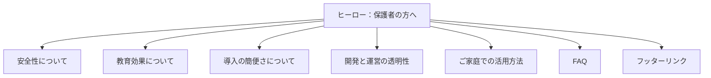

# EduQuest /parents ページ画面設計書

## 1. ページ概要

| 項目               | 内容                                                                                                         |
| ------------------ | ------------------------------------------------------------------------------------------------------------ |
| **ページ名**       | 保護者の方へ                                                                                                 |
| **URL**            | `/parents`                                                                                                   |
| **主目的**         | 安心感・教育的価値・導入のしやすさを伝え、保護者がEduQuestを安心して始められる状態を作る。                   |
| **主対象**         | 小学生の保護者（30〜40代が中心）。                                                                           |
| **副対象**         | 教育関係者、学習塾の指導者、学習サービスを探している保護者。                                                 |
| **デザイントーン** | 子ども主体で透明性を重視。白ベースに落ち着いたブルー／グリーンのアクセントを配し、安心感と信頼感を醸成する。 |

## 2. レイアウトマップ

### セクション別メッセージ

| セクション         | 伝えたい要点                                                                     |
| ------------------ | -------------------------------------------------------------------------------- |
| ヒーロー           | 「楽しく学べて安全」な体験を冒頭で提示し、主要CTAを目立たせる。                  |
| 安全性について     | プライバシー・セキュリティ・利用保護の仕組みを分かりやすく示し、安心感を高める。 |
| 教育効果について   | 学習理論とモチベーション設計の根拠を具体的に伝える。                             |
| 導入の簡便さ       | 手間なく始められ、複数デバイスに対応していることを強調する。                     |
| 開発と運営の透明性 | 開発体制やオープン性、問い合わせ窓口を明示し信頼を築く。                         |
| ご家庭での活用方法 | 日常の学習シーンをイメージできる具体例を提示する。                               |
| FAQ                | よくある疑問（安全・料金・端末など）を簡潔に解決する。                           |
| フッター           | 共通ナビゲーションとポリシーリンクを提供する。                                   |

## 3. セクション仕様

### 3.1 ヒーローセクション

| 要素         | 仕様                                                                                                                                                            |
| ------------ | --------------------------------------------------------------------------------------------------------------------------------------------------------------- |
| 見出し       | 👪 **保護者の方へ**                                                                                                                                             |
| サブテキスト | 「EduQuestは、小学生のお子さまが“遊びながら学ぶ”ことを目指した無料の学習プラットフォームです。**安全性・教育的効果・使いやすさ**の3つを大切に設計しています。」 |
| ビジュアル   | 親子がタブレットで学ぶイラストまたは柔らかな写真。やさしいグリーンのグラデーション背景。                                                                        |
| CTA          | プライマリーボタン「今すぐ体験する」→ `/`（トップページ）。テキストリンク「学習ステージを見る」→ `/math`。                                                      |
| レイアウト   | テキストは1行60〜70文字で収まるよう調整。CTAはモバイルでは縦積み、PCでは横並び。                                                                                |

### 3.2 安全性についてセクション

| 要素             | 仕様                                                                                                                                                                    |
| ---------------- | ----------------------------------------------------------------------------------------------------------------------------------------------------------------------- |
| 見出し           | 🔒 **安心して使える設計**                                                                                                                                               |
| 補足コピー       | 「EduQuestは収集データを最小限に抑え、子どもが集中できる環境を最優先しています。」                                                                                      |
| ポイント         | ・個人アカウント登録不要（すぐに開始可能） ・広告・外部リンクなし ・学習進捗は端末内ローカルに保存 ・通信はすべてHTTPSで暗号化 ・利用時間制限機能（開発中） |
| ビジュアル       | シールドやロックをモチーフにしたアイコン。テキスト＋アイコンの2カラム構成を想定。                                                                                       |
| インタラクション | 「セキュリティ対策を詳しく見る」リンクを `/trust-and-safety`（将来的に公開予定）へ。                                                                                    |

### 3.3 教育効果についてセクション

| 要素       | 仕様                                                                                                                                                                                         |
| ---------- | -------------------------------------------------------------------------------------------------------------------------------------------------------------------------------------------- |
| 見出し     | 📈 **楽しく学び、しっかり身につく**                                                                                                                                                          |
| 補足コピー | 「学校の学習指導要領に沿いながら、フィードバックでモチベーションを高める仕組みを備えています。」                                                                                             |
| 特徴       | ・教科書準拠の出題 ・段階的に難度が上がるレベル設計 ・AIが苦手単元を自動で復習 ・ポイントや称号などのゲーミフィケーション ・自己決定理論（自律性・有能感・関係性）に基づいた設計 |
| 図表       | 「学びの循環サイクル」：問題を解く → フィードバックを受ける → 理解が深まる → モチベーション向上 → 再び問題を解く、のループ図。                                                               |
| ビジュアル | クイズ画面やバッジ獲得のモックを掲載。                                                                                                                                                       |
| CTA        | インラインリンク「算数チャレンジを見る」→ `/math`。                                                                                                                                          |

### 3.4 導入の簡便さセクション

| 要素       | 仕様                                                                                                                                                                              |
| ---------- | --------------------------------------------------------------------------------------------------------------------------------------------------------------------------------- |
| 見出し     | 💻 **すぐに使い始められます**                                                                                                                                                     |
| 補足コピー | 「インストール不要で、すでにあるデバイスからすぐに学習を開始できます。」                                                                                                          |
| 特徴       | ・ブラウザだけで利用可能（ダウンロード不要） ・PC／タブレット／スマホ対応 ・1クリックで学習開始 ・進捗はローカルストレージに自動保存 ・家庭・学校・学習塾でも利用可能 |
| CTA        | セカンダリーボタン「学習を始める」→ ヒーローCTA位置へスクロール。                                                                                                                 |
| ビジュアル | デスクトップ・タブレット・スマホが並ぶイラスト。統一感のあるシャドウと角丸。                                                                                                      |

### 3.5 開発と運営の透明性セクション

| 要素       | 仕様                                                                                                                                                                                                                                                                           |
| ---------- | ------------------------------------------------------------------------------------------------------------------------------------------------------------------------------------------------------------------------------------------------------------------------------ |
| 見出し     | 🪪 **オープンで誠実な運営**                                                                                                                                                                                                                                                    |
| コンテンツ | ・開発運営：_EduQuest Project_ ・リードエンジニア：[tqer39](https://github.com/tqer39)（教育系SRE） ・ソースコード：[GitHub Repository](https://github.com/tqer39/edu-quest) ・プライバシーポリシー：`/privacy`（公開予定） ・お問い合わせ：`contact@eduquest.app` |
| ビジュアル | GitHubロゴや透明感のあるグラデーション背景。                                                                                                                                                                                                                                   |
| レイアウト | アイコン付きカードまたはリスト形式。リンクはWCAG AA以上のコントラストを確保。                                                                                                                                                                                                  |

### 3.6 ご家庭での活用方法セクション

| 要素       | 仕様                                                                                                                                               |
| ---------- | -------------------------------------------------------------------------------------------------------------------------------------------------- |
| 見出し     | 🏡 **ご家庭での活用シーン**                                                                                                                        |
| シナリオ   | ・宿題後の10分復習 ・親子で一緒にチャレンジ ・登校前／就寝前の短時間復習 ・兄弟姉妹での競争 ・学習連続日数の可視化による習慣化サポート |
| ビジュアル | リビング学習のイラストや、 streak 表示付きスケジュールカードのモック。                                                                             |
| レイアウト | PCでは横スライダー、モバイルでは縦積みカード構成を想定。                                                                                           |

### 3.7 FAQセクション

| 要素       | 仕様                                                                                                                                                                                                                                                                                                                                             |
| ---------- | ------------------------------------------------------------------------------------------------------------------------------------------------------------------------------------------------------------------------------------------------------------------------------------------------------------------------------------------------ |
| 見出し     | ❓ **よくある質問**                                                                                                                                                                                                                                                                                                                              |
| QA         | **Q1. 会員登録は必要ですか？** — いいえ。すぐに使い始められます。 **Q2. 料金はかかりますか？** — いいえ。現在の機能はすべて無料です。 **Q3. どの端末で使えますか？** — PC・タブレット・スマートフォンなど、ブラウザがあれば利用できます。 **Q4. 広告や個人情報の心配は？** — 広告は表示せず、個人情報も不要。通信は暗号化されています。 |
| レイアウト | アコーディオンUIを想定。初期状態は展開しておき、読みやすさを優先。                                                                                                                                                                                                                                                                               |

### 3.8 フッターセクション

| 要素         | 仕様                                                                                                                                 |
| ------------ | ------------------------------------------------------------------------------------------------------------------------------------ |
| 表示内容     | `© 2025 EduQuest` リンク：ホーム（`/`）、保護者の方へ（`/parents`）、GitHub Repository、プライバシーポリシー（`/privacy`予定）。 |
| スタイリング | サイト共通のフッタースタイル。落ち着いたグレー背景に白または濃紺の文字色。余白とラインの高さを他ページと揃える。                     |

## 4. ビジュアルガイドライン

| 要素             | 指針                                                                                                     |
| ---------------- | -------------------------------------------------------------------------------------------------------- |
| タイポグラフィ   | Noto Sans JPやInter Roundedなどの角丸サンセリフ体。最小16px・行間1.8を基準とする。                       |
| カラーパレット   | メインブルー `#3B82F6`、アクセントグリーン `#22C55E`、背景グレイ `#F9FAFB`、テキストネイビー `#1F2937`。 |
| グリッド         | モバイルは1カラム、PCはテキストとビジュアルの2カラム分割。セクション間隔は最小64px。                     |
| アイコン         | Lucide系ラインアイコンまたは親しみやすい絵文字を使用。                                                   |
| アクセシビリティ | WCAG AA準拠のコントラスト、画像の代替テキスト、フォーカス時の視認性確保。                                |

## 5. KPI目標

| 指標             | 目標値                                                                |
| ---------------- | --------------------------------------------------------------------- |
| 平均滞在時間     | 60秒以上（安心・信頼コンテンツを読了できる）。                        |
| `/` への遷移率   | 30％以上（トップページへの誘導を確認）。                              |
| スクロール率     | 70％以上（ページ中盤まで閲覧される）。                                |
| 自然検索での意図 | 「EduQuest 安全性」「小学生 学習 安心」などの検索ワードで信頼を獲得。 |

## 6. 今後の拡張案

- 教育監修者・アドバイザーの紹介セクションを追加。
- 匿名化した学習成果の統計ダッシュボードを公開。
- 家庭向けプリント教材のダウンロードを提供。
- 保護者向け学習状況ダッシュボードβ版を開発して共有。
