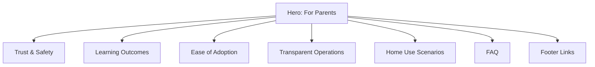

# EduQuest /parents Page Screen Design Specification

## 1. Page Overview

| Item | Details |
| --- | --- |
| **Page name** | For Parents |
| **URL** | `/parents` |
| **Primary goal** | Convey trust, educational value, and ease of adoption so caregivers feel confident starting EduQuest. |
| **Primary audience** | Parents of elementary school students (primarily 30s–40s). |
| **Secondary audience** | Educators, cram school operators, caregivers researching learning tools. |
| **Design tone** | Calm, transparent, and child-first. Use a white base with gentle blue/green accents that echo the EduQuest brand. |

## 2. Layout Map

### Section Purpose Summary

| Section | Key message |
| --- | --- |
| Hero | Set the tone of "fun yet safe" learning right away and surface the primary CTA. |
| Trust & Safety | Demonstrate the platform’s privacy, security, and usage protections for children. |
| Learning Outcomes | Explain the learning science behind EduQuest and how it sustains motivation. |
| Ease of Adoption | Highlight the frictionless onboarding and multi-device compatibility. |
| Transparent Operations | Showcase the development team, open-source stance, and contact channels. |
| Home Use Scenarios | Inspire day-to-day use cases that families can picture immediately. |
| FAQ | Answer recurring safety, cost, and device questions succinctly. |
| Footer | Provide consistent navigation and policy links. |

## 3. Section Specifications

### 3.1 Hero Section

| Element | Specification |
| --- | --- |
| Heading | 👪 **For Parents** |
| Subtext | "EduQuest is a free learning platform where elementary school children learn by playing. We design every feature around **safety, proven learning impact, and ease of use** so you can confidently let your child explore." |
| Visual direction | Illustration or soft photo of a parent and child learning together on a tablet. Use a gentle green background gradient. |
| CTA | Primary button: “Try It Now” → `/` (opens top page). Secondary text link: “Explore Learning Stages” → `/math`. |
| Layout notes | Keep hero copy within 60–70 characters per line for readability. CTA stack vertically on mobile, horizontally on desktop. |

### 3.2 Trust & Safety Section

| Element | Specification |
| --- | --- |
| Heading | 🔒 **Safe by Design** |
| Supporting copy | “Safety for young learners comes first. EduQuest minimizes data collection and blocks distractions so children can focus.” |
| Highlighted bullet points | • No personal account required (play instantly) • No ads or outbound links • Learning progress stored locally on the device only • All communication secured via HTTPS • Optional playtime limiter (in development) |
| Visual direction | Shield icon set or friendly lock illustration. Consider a two-column layout with copy on the left and an icon grid on the right. |
| Interaction | Add a “Learn more about security” link pointing to a future `/trust-and-safety` page. |

### 3.3 Learning Outcomes Section

| Element | Specification |
| --- | --- |
| Heading | 📈 **Engaging and Effective Learning** |
| Supporting copy | “EduQuest follows the school curriculum while motivating children through adaptive feedback.” |
| Feature bullets | • Curriculum-aligned challenges • Step-up difficulty tiers for steady growth • AI-powered review of weak topics • Gamified points, titles, and badges • Designed around Self-Determination Theory (autonomy, competence, relatedness) |
| Diagram | Include a loop diagram titled “Learning Cycle” using the flow: Solve Problems → Receive Feedback → Deepen Understanding → Boost Motivation → back to Solve Problems. |
| Visual direction | Screenshot mock or stylized depiction of the quiz UI and badge animations. |
| CTA | Inline link: “View math challenge examples” → `/math`. |

### 3.4 Ease of Adoption Section

| Element | Specification |
| --- | --- |
| Heading | 💻 **Start in Seconds** |
| Supporting copy | “Nothing to install. EduQuest runs anywhere your child already learns.” |
| Feature bullets | • Browser-based—no downloads • Works on PC, tablet, and smartphone • One click to begin a practice session • Auto-saves progress to local storage • Suitable at home, school, or after-school programs |
| CTA | Secondary button: “Start Learning” → hero CTA anchor. |
| Visual direction | Device trio illustration (desktop, tablet, smartphone) with consistent shadows and rounded corners. |

### 3.5 Transparent Operations Section

| Element | Specification |
| --- | --- |
| Heading | 🪪 **Open and Trustworthy Team** |
| Content list | • Developed by *EduQuest Project* • Lead engineer: [tqer39](https://github.com/tqer39) (Education-focused SRE) • Source code: [GitHub Repository](https://github.com/tqer39/edu-quest) • Privacy Policy: `/privacy` (coming soon) • Contact: `contact@eduquest.app` |
| Visual direction | Use GitHub brand mark or a transparency-themed gradient background. |
| Layout notes | Present as cards or a compact list with icons for each item. Ensure link contrast meets WCAG AA. |

### 3.6 Home Use Scenarios Section

| Element | Specification |
| --- | --- |
| Heading | 🏡 **How Families Use EduQuest** |
| Scenario list | • 10-minute practice after homework • Parent-child quiz challenges • Quick review before school or bedtime • Friendly competitions between siblings • Habit support with visible streak counter |
| Visual direction | Cozy living-room illustration or schedule card mockup showing streaks and reminders. |
| Layout notes | Consider a horizontal carousel on desktop and stacked cards on mobile. |

### 3.7 FAQ Section

| Element | Specification |
| --- | --- |
| Heading | ❓ **Frequently Asked Questions** |
| QA pairs | **Q1. Do we need to register?** — No. Children can start immediately. **Q2. Is it really free?** — Yes. All current features are free of charge. **Q3. Which devices are supported?** — Any modern browser on PC, tablet, or smartphone works. **Q4. Are there ads or privacy risks?** — We show no ads, require no personal data, and encrypt all traffic. |
| Layout | Use accordion components so parents can skim quickly. Default to expanded state on first load for accessibility. |

### 3.8 Footer Section

| Element | Specification |
| --- | --- |
| Content | `© 2025 EduQuest` Links: Home (`/`), For Parents (`/parents`), GitHub Repository, Privacy Policy (`/privacy`, planned). |
| Styling | Shared global footer styling—muted gray background with white or navy text. Maintain consistent spacing with other pages. |

## 4. Visual Guidelines

| Element | Guideline |
| --- | --- |
| Typography | Rounded sans-serif system such as Noto Sans JP (Japanese) and Inter Rounded (English). Maintain minimum 16px base size and 1.8 line height. |
| Color palette | Primary blue `#3B82F6`, accent green `#22C55E`, background gray `#F9FAFB`, text navy `#1F2937`. |
| Grid | Single-column layout on mobile. Two-column split for content/visual pairing on desktop with 64px section spacing. |
| Iconography | Prefer Lucide line icons or emoji to maintain friendliness. |
| Accessibility | Ensure WCAG AA contrast, provide descriptive alt text for images, and keep CTA focus states visible. |

## 5. KPI Targets

| Metric | Goal |
| --- | --- |
| Average time on page | ≥ 60 seconds (indicates caregivers absorb trust messaging). |
| Click-through to home | ≥ 30% from `/parents` to `/`. |
| Scroll depth | ≥ 70% of visitors reach the mid-page sections. |
| Organic search intent | Rank for queries such as “EduQuest safety” and “elementary learning platform secure.” |

## 6. Future Enhancements

- Add educator endorsements or supervisor introductions.
- Publish anonymized learning outcome dashboards.
- Offer downloadable home printables for offline reinforcement.
- Build a caregiver dashboard beta to share progress analytics.
